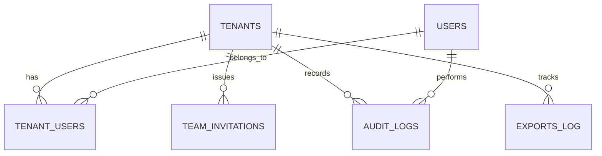

# Phase 8: Workspace Administration, Team Governance & Scaling

## 1. Executive Summary
Phase 8 transforms ShrMail from a single-user marketing tool into a collaborative, enterprise-ready platform. It introduces advanced administrative controls, a multi-tenant franchise model, and strict governance protocols to ensure data isolation, security, and operational scaling.

### Core Objectives
*   **Decoupled Governance**: Separation of platform administration from workspace marketing operations.
*   **Granular RBAC**: Implementing Owner, Manager, and Member roles with specific permission scopes.
*   **Franchise Ecosystem**: Allowing master accounts to provision and govern child workspaces (Franchises).
*   **Audit & Compliance**: Maintaining a permanent trail of administrative actions and enabling data portability.

---

## 2. Core Operating Model

### 2.1 Role-Based Access Control (RBAC)
ShrMail uses a strictly enforced RBAC system where a user's permissions are derived from their role within a specific workspace.

| Role | Description | Key Permissions |
| :--- | :--- | :--- |
| **OWNER** | The legal and administrative head of the workspace. | Manage Roles, Billing, Domain Verification, Transfer Ownership, Delete Workspace. |
| **MANAGER** | An operational administrator. | Invite Members, Manage Sending Domains, View Team, Export Data (scoped). |
| **MEMBER** | A tactical contributor. | Create Campaigns, Import Contacts, View Analytics, Manage Templates. |

### 2.2 Workspace Hierarchy
Workspaces are categorized into two primary types to support both direct customers and agency/franchise models.

*   **MAIN**: A standard, standalone workspace.
*   **FRANCHISE**: A child workspace linked to a parent `MAIN` workspace. It possesses its own isolated data but is governed by the parent's administration.

### 2.3 Isolation Models
*   **TEAM**: Shared access to all campaigns and contacts within the workspace.
*   **AGENCY**: (Roadmap) Restricted visibility where members only see resources they created.

---

## 3. Data Architecture

### 3.1 Database Schema
The administration system relies on five core tables in the Supabase/PostgreSQL backend.

| Table | Purpose | Critical Columns |
| :--- | :--- | :--- |
| `tenants` | Workspace identity and configuration. | `id`, `company_name`, `workspace_type`, `parent_tenant_id`, `onboarding_required`. |
| `tenant_users` | Mapping of users to workspaces with roles. | `tenant_id`, `user_id`, `role`, `isolation_model`, `joined_at`. |
| `team_invitations` | Pending access requests. | `email`, `token`, `role`, `invite_type`, `franchise_tenant_id`, `expires_at`. |
| `audit_logs` | Immutable record of system mutations. | `tenant_id`, `user_id`, `action`, `resource_type`, `metadata`. |
| `exports_log` | Tracking data portability requests. | `requested_by`, `format`, `status`, `filters`. |

---

## 4. API Reference (Phase 8 Endpoints)

### 4.1 Team Management (`/api/team`)
*   **`GET /members`**: Lists all active members and their roles.
*   **`POST /invites`**: Issues a new invitation. (Rate limited: 10/hr).
*   **`DELETE /members/{user_id}`**: Removes a member. (Requires `MANAGE_TEAM`).
*   **`PATCH /members/{user_id}/role`**: Updates a member's role. (Owner only).
*   **`POST /members/{user_id}/transfer-ownership`**: Hands over workspace control.

### 4.2 Franchise Management (`/api/team/franchises`)
*   **`GET /franchises`**: Lists all child workspaces.
*   **`POST /franchises`**: Provisions a new child workspace and sends an owner invite.
*   **`POST /franchises/{id}/suspend`**: Instantly disables a child workspace.
*   **`DELETE /franchises/{id}`**: Irreversibly deletes a child workspace and its data.

### 4.3 Data Portability
*   **`GET /members/export`**: Generates a CSV of the current team.
    *   *Managers* can only export members they personally invited.
    *   *Owners* can export the entire directory.

---

## 5. UI/UX Workflows

### 5.1 Workspace Creation & Onboarding
When a user creates a new workspace via `POST /auth/workspaces`:
1.  A new `tenant` record is created with `onboarding_required: TRUE`.
2.  The creator is assigned the `OWNER` role in `tenant_users`.
3.  The frontend intercepts the login and redirects to `/setup` if `onboarding_required` is true.

### 5.2 The Invitation Lifecycle
1.  **Invite**: Admin enters email and selects role. Token is generated and emailed.
2.  **Validate**: Invitee clicks link; frontend calls `GET /invites/validate`.
3.  **Accept**: Invitee logs in/signs up; backend calls `POST /invites/accept`.
4.  **Join**: User is added to `tenant_users`, and the token is invalidated.

---

## 6. Governance & Security

### 6.1 Destructive Action Safeguards
*   **Last-Owner Protection**: The system prevents the last remaining Owner from leaving or being removed to avoid orphaned workspaces.
*   **Ownership Transfer**: Requires explicit confirmation and automatically downgrades the previous owner to `MANAGER`.
*   **Franchise Suspension**: Decoupled from deletion; allows "freeze" a workspace without data loss.

### 6.2 Industry Standards & Workspace Limits
Following B2B SaaS best practices (Slack, Notion, Linear):
*   **Creation Limits**: Users are limited to 5 workspace creations per hour to prevent bot spam.
*   **Member Caps**: (Roadmap) Enforced via subscription tiers (e.g., Free: 3 members, Pro: Unlimited).
*   **Audit Retention**: Audit logs are retained for 90 days (Standard) or 1 year (Enterprise).

### 6.3 Session Persistence
*   **JWT Hydration**: AuthContext restores the session from `localStorage` on refresh.
*   **Silent Refresh**: On 401 (Expired Token), the frontend attempts to call `/auth/refresh` using the `HttpOnly` refresh cookie before logging the user out.

---

## 7. Delivery Checklist (Final Status)

| Feature | Status | Note |
| :--- | :--- | :--- |
| **RBAC Core** | ✅ COMPLETE | Owner/Manager/Member roles enforced. |
| **Workspace Creation** | ✅ COMPLETE | Direct creation with onboarding flag. |
| **Team Invites** | ✅ COMPLETE | Token-based flow with expiry. |
| **Member Management** | ✅ COMPLETE | Role updates and removals. |
| **CSV Exports** | ✅ COMPLETE | Filtered exports with audit logging. |
| **Franchise System** | ✅ COMPLETE | Parent-child workspace provisioning. |
| **Audit Logs** | ✅ COMPLETE | Records all team and franchise mutations. |
| **Ownership Transfer** | ✅ COMPLETE | Secure handover protocol. |
| **Session Recovery** | ✅ COMPLETE | Refresh token fallback logic. |

---
**Document Version**: 1.0.1  
**Last Updated**: 2026-04-27  
**Owner**: Platform Engineering Team
