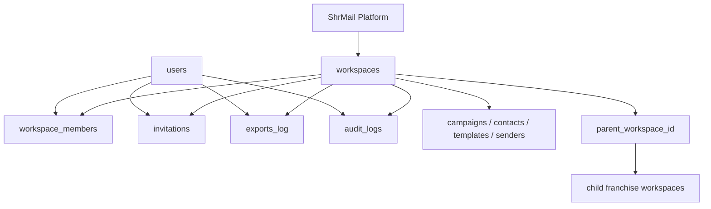
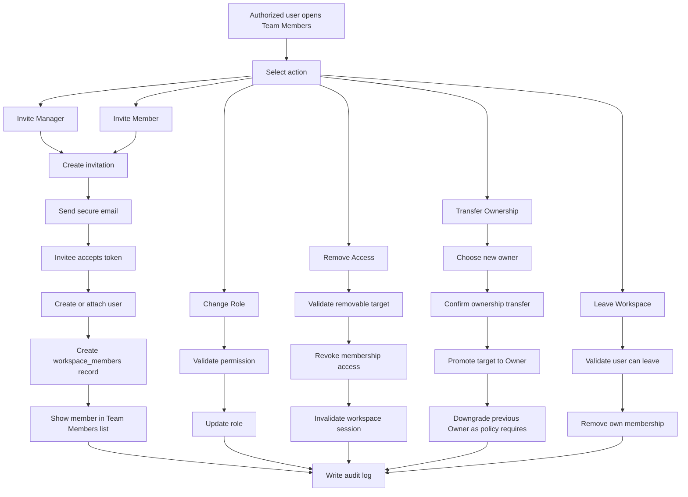
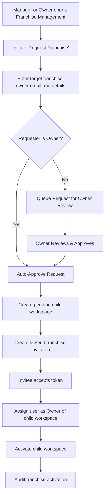
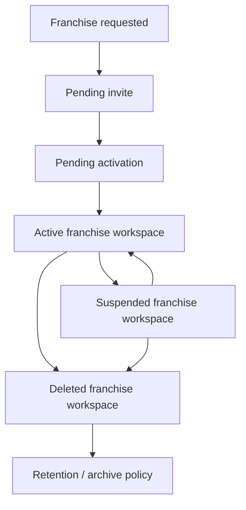
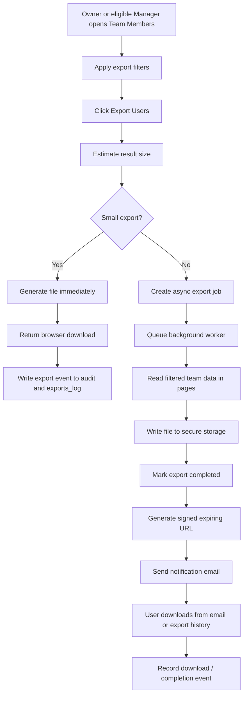
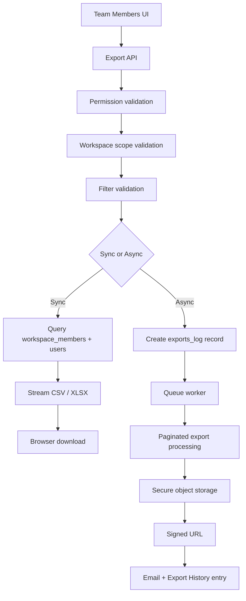
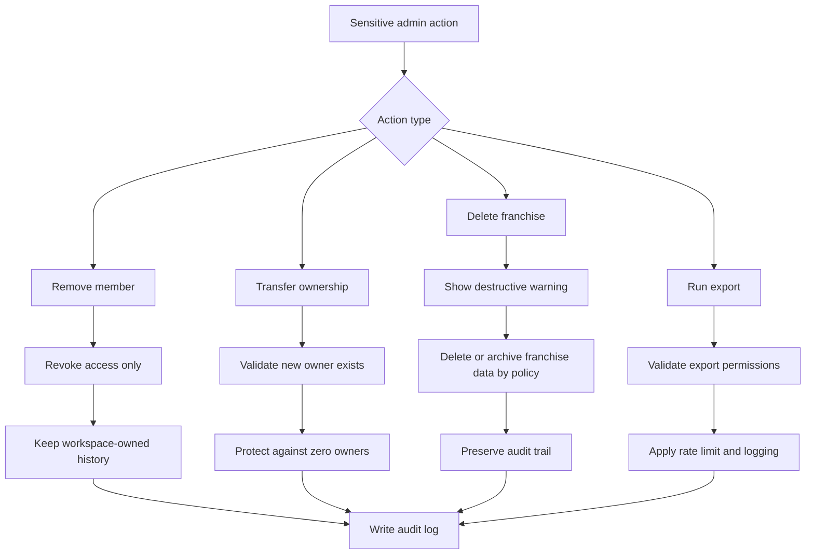
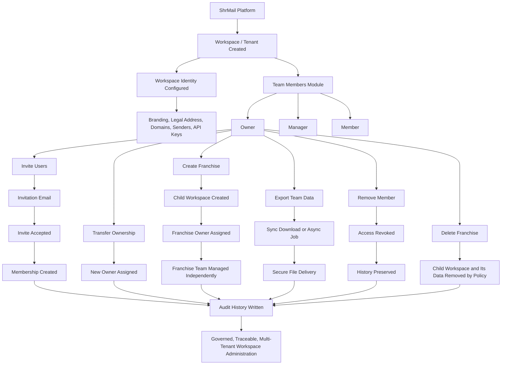

# Phase 8 — ShrMail Workspace, Team & Franchise Administration

> **Status:** Planning and documentation phase
> **Last Reviewed:** April 26, 2026

## Executive Summary

Phase 8 defines how ShrMail is operated after a tenant workspace exists. This phase is not only about a settings page. It is the full operating system for workspace ownership, team membership, franchise workspaces, export controls, and governance.

ShrMail follows a multi-tenant architecture where every company operates inside its own workspace. A workspace is the security and ownership boundary for users, campaigns, contacts, templates, sender identities, exports, and audit history. Within that workspace, roles determine what each person can do. The Owner has full administrative authority. The Manager handles day-to-day operations inside approved boundaries. The Member participates in execution but does not control workspace administration.

Franchise management extends this model. A franchise is not just another role inside the same workspace. It is a separate child workspace linked to a parent workspace. That child workspace has its own Owner, members, campaigns, contacts, domains, senders, exports, and audit trail. This preserves clean tenant isolation while still allowing the parent workspace to create and govern franchise instances.

This phase also covers user exports. Exports are treated as a controlled administrative workflow rather than a utility button. Owners can export workspace member data, while Managers can export only within the scope permitted by policy. Small exports download immediately. Larger exports run asynchronously, are logged, stored securely, and delivered through expiring download links.

The final part of this phase is governance. Every sensitive action must be attributable, reversible where appropriate, and explicitly destructive where it is not reversible. Invitations, removals, ownership transfer, franchise deletion, and exports all create audit history. Removing a user removes access, not workspace-owned business data. Deleting a franchise removes the franchise workspace and everything inside it according to policy.

## Phase 8 Scope

Phase 8 contains five connected subphases:

- `Phase 8.1` Workspace Administration Foundation
- `Phase 8.2` Team Members, Roles, Invites, and Ownership
- `Phase 8.3` Franchise Workspace Lifecycle
- `Phase 8.4` Team Data Export and Reporting
- `Phase 8.5` Governance, Audit, and Destructive Action Policy

These are grouped into one parent phase because they all depend on the same foundations:

- workspace-based multi-tenancy
- role-aware permissions
- invitation and membership lifecycle
- parent-child workspace relationships
- secure export controls
- audit and retention policy

## Core Operating Model

ShrMail is organized around the workspace. Every user belongs to one or more workspaces through membership records, and every business object is scoped to a workspace. Nothing important is owned only by an individual user. Campaigns, contacts, templates, sender identities, exports, audit logs, and franchise relationships are all anchored to the workspace so the company retains continuity even when people join, leave, or change roles.

Roles are intentionally simple:

- `Owner`: full administrative authority over the workspace
- `Manager`: operational authority with limited administrative actions
- `Member`: execution-only or visibility-limited role

A franchise owner is not modeled as a special extra role in the parent workspace. Instead, that user becomes the `Owner` of a new child workspace.

## End-to-End Architecture

The following diagram should be read from top to bottom. It starts at the ShrMail platform layer and moves downward into workspace structure, team structure, franchise branching, exports, and governance.

```mermaid
graph TD

%% ROOT
A[ShrMail Platform]

%% WORKSPACE
A --> B[Workspace / Tenant]

%% USER MANAGEMENT
B --> C[User Management]

C --> C1[Owner 👑]
C --> C2[Manager 🧑💼]
C --> C3[Member 👨💻]

%% OWNER POWERS
C1 --> O1[Invite Users]
C1 --> O2[Assign Roles]
C1 --> O3[Remove Users]
C1 --> O4[Transfer Ownership 🔁]
C1 --> O5[Billing Control]
C1 --> O6[Approve Requests]
C1 --> O7[Approve Franchise]

%% MANAGER CREATION FLOW
O1 --> MAdd[Owner invites user]
MAdd --> MRole[Assign as Manager]

%% MEMBER CREATION FLOW
O1 --> MbAdd[Owner/Manager invites user]
MbAdd --> MbRole[Assign as Member]

%% OWNERSHIP TRANSFER
O4 --> T1[Select Existing Member]
O4 --> T2[Or Invite New User]
T1 --> T3[Make New Owner]
T2 --> T3
T3 --> T4[Old Owner becomes Manager (optional)]

%% MANAGER PERMISSIONS
C2 --> M1[Create Campaigns]
C2 --> M2[Send Emails]
C2 --> M3[Manage Contacts]
C2 --> M4[View Analytics]
C2 --> M5[View Billing]
C2 --> M6[Invite Members]
C2 --> M7[Request Actions]

M7 --> MR1[Request Billing Change]
M7 --> MR2[Request Franchise]

%% MEMBER PERMISSIONS
C3 --> MB1[Create Campaigns]
C3 --> MB2[Send Emails]
C3 --> MB3[View Analytics]
C3 --> MB4[View Billing]

%% CORE SYSTEMS
B --> D[Core Systems]

D --> D1[Campaigns]
D --> D2[Contacts]
D --> D3[Analytics]
D --> D4[Billing & Usage]
D --> D5[Senders]
D --> D6[Permissions]
D --> D7[Requests]
D --> D8[Notifications]
D --> D9[Activity Logs]

%% BILLING RULES
D4 --> BR1[Only Owner can Change Plan]
D4 --> BR2[Manager/Member View Only]
D4 --> BR3[Usage Shared Across Workspace]

%% REQUEST FLOW
D7 --> R1[Manager Creates Request]
R1 --> R2[Owner Reviews]
R2 --> R3[Approve or Reject]
R3 --> R4[Execute if Approved]

%% SENDER RULES
D5 --> S1[Owner Verifies Sender]
S1 --> S2[All Members Use Sender]

%% FRANCHISE SYSTEM
B --> E[Franchise System]

E --> E1[Manager/Owner Request Franchise]
E1 --> E2[Owner Approval Required]
E2 --> E3[Create New Workspace]

%% FRANCHISE WORKSPACE
E3 --> F[Franchise Workspace]

F --> F1[Franchise Owner]
F --> F2[Franchise Managers]
F --> F3[Franchise Members]

F --> F4[Own Campaigns]
F --> F5[Own Contacts]
F --> F6[Own Billing]
F --> F7[Own Senders]

%% RELATIONSHIP
B --> REL1[Parent Workspace]
REL1 --> REL2[Linked to Franchise Workspace]

%% RULES
B --> G[Global Rules]

G --> G1[Tenant = Container]
G --> G2[Owner = Highest Authority]
G --> G3[Manager Cannot Change Billing]
G --> G4[Manager Cannot Create Franchise Directly]
G --> G5[Members Have Limited Access]
G --> G6[Franchise is Separate Workspace]
```

## 8.1 Workspace Administration Foundation

This subphase defines the administrative backbone of the workspace. Everything else in Phase 8 depends on it.

### Workspace as the Security Boundary

The workspace is the primary tenant boundary in ShrMail. Every query, mutation, export, dashboard card, and administrative action must resolve against a workspace context. A user may belong to multiple workspaces, but every action happens inside one active workspace at a time.

That means:

- campaigns belong to a workspace
- contacts belong to a workspace
- templates belong to a workspace
- domains and senders belong to a workspace
- invitations belong to a workspace
- exports belong to a workspace
- audit history belongs to a workspace

This avoids a fragile model where data follows the individual instead of the company.

### Workspace Administrative Areas

The workspace administration surface should contain all of the following areas inside one coherent settings and management shell:

- profile and organization details
- branding and visual identity
- CAN-SPAM legal address
- domain verification
- sender verification
- API key management
- team members
- franchise accounts
- export history
- compliance and audit visibility

### Foundational Data Model

The minimum data objects required for this phase are:

- `workspaces`
  stores workspace identity, plan context, legal details, branding metadata, status, and `parent_workspace_id` for franchises
- `users`
  stores identity-level user details such as name, email, authentication identity, and security metadata
- `workspace_members`
  stores the membership relationship between a user and a workspace with role, join date, inviter, and removal metadata
- `invitations`
  stores invite email, target workspace, target role, token, expiry, inviter, status, and acceptance data
- `exports_log`
  stores requester, workspace, filters, output format, status, progress, storage metadata, and download expiry
- `audit_logs`
  stores actor, action, entity, entity identifier, workspace context, and timestamped event history

### Foundation Relationship Map



### Administrative Permission Philosophy

Permissions are not just UI toggles. They are enforced at every level:

- UI visibility
- API authorization
- database filtering
- export eligibility
- destructive action confirmation

The interface may hide or disable unauthorized actions, but backend enforcement is still mandatory.

## 8.2 Team Members, Roles, Invites, and Ownership

This subphase defines how people enter, operate within, and leave a workspace.

### Role Definitions

#### Owner

The Owner is the primary administrative authority for a workspace.

The Owner can:

- manage workspace settings
- invite Managers and Members
- invite Franchise Owners
- remove Managers and Members
- transfer ownership
- control exports
- manage domain and sender settings
- control high-risk destructive actions

The Owner cannot leave the workspace if they are the last Owner. Ownership must always remain assigned to at least one valid member.

#### Manager

The Manager is responsible for daily operations rather than full administration.

The Manager can:

- run campaigns
- manage contacts and audience operations
- view operational analytics
- possibly invite Members if this is allowed by policy
- possibly export limited user lists if policy allows
- **Request Actions:** Create requests for high-level actions (Billing changes, Franchise creation) for Owner review.

The Manager cannot:

- transfer ownership
- remove the Owner
- manage billing-level authority
- create unrestricted franchise structures
- override workspace-wide destructive actions

#### Member

The Member participates in approved work inside the workspace.

The Member can:

- participate in campaign workflow
- access reports and areas specifically granted to the role
- leave the workspace voluntarily

The Member cannot:

- invite users
- remove users
- transfer ownership
- export admin data

### Invitation Lifecycle

Invitations are the standard entry point into a workspace. ShrMail should not silently attach people to a workspace without a verified invitation path.

The invitation lifecycle is:

1. an authorized user opens Team Members
2. they choose the target role
3. they enter the email address
4. ShrMail creates a secure invitation record
5. ShrMail sends a verification email with an expiring token
6. the invitee accepts the token
7. ShrMail creates or links the user account
8. ShrMail creates the workspace membership
9. ShrMail records the event in audit history

Invites should support:

- resend
- cancel
- expire automatically
- prevent duplicate active invites for the same role and email where appropriate

### Team Member Lifecycle



### Ownership Transfer

Ownership transfer is one of the highest-risk workspace actions and should be treated accordingly.

The transfer process should:

- allow transfer to an existing member or a newly invited user
- require a deliberate confirmation step
- prevent the workspace from becoming ownerless
- record the previous owner and the new owner in audit history
- **Role Downgrade:** The previous owner can optionally be downgraded to Manager or Member.

### Removal and Historical Continuity

Removing a user should revoke access, not erase workspace-owned content. If a removed user created campaigns, contacts, or templates, those records stay with the workspace. Historical continuity matters more than strict personal ownership of content.

This means the preferred behavior is:

- remove or deactivate membership
- preserve authored history
- preserve audit trail
- invalidate workspace access immediately

## 8.3 Franchise Workspace Lifecycle

This subphase defines how one workspace can create and govern franchise workspaces.

### Franchise Model

A franchise is a child workspace, not just a privileged member. It exists under a parent workspace relationship but remains isolated in its own operational scope.

Each franchise workspace has:

- its own Owner
- its own Managers and Members
- its own campaigns
- its own contacts
- its own domains and senders
- its own export history
- its own audit trail

The parent workspace may create and monitor franchises, but parent users should not automatically gain unrestricted access to franchise data unless a future shadow-mode or delegated support model is explicitly designed.

### Franchise Creation Lifecycle

The creation of a franchise follows the Request-Approval orchestration.



### Parent and Child Workspace Rules

The parent workspace can:

- create franchise workspaces
- view franchise status and summary metadata
- suspend or delete a franchise according to policy
- track franchise ownership and operational state

The parent workspace should not automatically:

- see all child contacts
- see all child campaigns
- edit all child settings directly
- export all child member data without explicit design approval

This protects tenant isolation and keeps franchise workspaces meaningfully independent.

### Franchise Deletion

Franchise deletion is a workspace-level destructive action. It is not equivalent to removing one user.

Deleting a franchise should:

- revoke access for franchise users in that child workspace
- remove or archive child workspace data according to policy
- preserve an audit trail of who deleted it and when
- warn the parent Owner that the action affects campaigns, contacts, templates, members, and operational history inside that franchise

### Franchise Lifecycle Map



## 8.4 Team Data Export and Reporting

This subphase covers export of team and membership data from the Team Members area.

### Export Philosophy

Exports are a governed administrative feature. They expose controlled business data and must respect role boundaries, workspace boundaries, and audit requirements.

The export feature should support:

- export from the Team Members page
- filtering by role
- filtering by inviter or manager
- filtering by status
- CSV output by default
- optional XLSX output if needed
- direct download for small result sets
- background jobs for larger result sets
- secure file storage
- expiring download links

### Export User Flow



### Export Rules

- Owners can export all workspace member data allowed by policy.
- Managers can export only the subset of users they are allowed to see.
- Members cannot export team data.
- Export generation should be rate-limited.
- Concurrent export storms from the same workspace should be controlled.
- Every export request must create a durable log entry.

### Expected Export Columns

The baseline export should include:

- first name
- last name
- email
- role
- invited by
- joined date
- membership status

Additional fields can be added later, but the first release should stay focused on team administration use cases.

### Export System Architecture



## 8.5 Governance, Audit, and Destructive Action Policy

This subphase ensures that all high-risk actions in Phase 8 are accountable and policy-driven.

### Audit Requirements

The following actions must produce audit records:

- invite created
- invite resent
- invite cancelled
- invite accepted
- role changed
- member removed
- user left workspace
- ownership transferred
- franchise created
- franchise activated
- franchise suspended
- franchise deleted
- export requested
- export completed
- export downloaded

### Retention and Historical Policy

ShrMail should preserve operational continuity while still respecting administrative removals.

That means:

- membership records may be soft-deactivated or timestamped as removed
- workspace-owned records should remain intact
- audit history must remain queryable after user removal
- export history should remain visible for compliance review
- franchise deletion should preserve at least audit-level history even if business data is hard-deleted

### Last Owner Protection

The system must prevent a workspace from losing its final Owner accidentally. Any action that would remove or invalidate the last Owner must fail until another valid Owner is assigned.

### Destructive Action Map



### Governance Summary

The governance layer exists so that ShrMail administration is not only functional, but safe:

- no silent privilege changes
- no invisible destructive actions
- no cross-workspace leakage
- no export without accountability
- no loss of company-owned continuity when people leave

## Complete Vertical Flow From ShrMail to End State

This final diagram ties the entire phase together in one continuous top-down flow.



## Detailed Delivery Checklist

### 8.1 Foundation ✅

- ✅ workspace administration shell documented
- ✅ workspace identity model documented
- ✅ membership model documented
- ✅ parent-child workspace model documented (`parent_tenant_id`, `workspace_type`, `franchise_status` columns — migration 036)
- ✅ permission enforcement model documented
- ✅ `_normalize_public_role()` — `admin` → `manager` mapping in backend
- ✅ `_normalize_storage_role()` — `manager` → `admin` reverse mapping for DB writes
- ✅ `AuthContext.tsx` — `normalizeRole()` maps JWT role `admin` → `manager`

### 8.2 Team Management ✅

- ✅ Team Members page (`/settings/team`)
- ✅ Owner / Manager / Member role definitions
- ✅ invite manager flow
- ✅ invite member flow
- ✅ resend invite flow
- ✅ cancel invite flow
- ✅ invitation acceptance flow (`/team/join`)
- ✅ inviter name shown on pending invites
- ✅ change role flow
- ✅ remove member flow
- ✅ leave workspace flow (Profile page → "Leave Workspace" section)
- ✅ ownership transfer flow (with confirm modal)
- ✅ last-owner protection (backend enforced via `_count_owners()`)
- ✅ export members flow (CSV sync download)

### 8.3 Franchise Lifecycle ✅

- ✅ Franchise Accounts page (`/settings/franchises`)
- ✅ add franchise flow (owner email + workspace name)
- ✅ child workspace provisioning (`POST /team/franchises`)
- ✅ `pending_invite / active / suspended / deleted` franchise statuses
- ✅ `workspace_type` and `franchise_status` constraints on `tenants` table (migration 036)
- ✅ `invite_type` and `franchise_tenant_id` on `team_invitations` table (migration 036)
- ✅ franchise suspend / reactivate / delete actions
- ✅ franchise isolation — each franchise is its own tenant with independent campaigns, contacts, senders

### 8.4 Export ✅

- ✅ Team Members export control (owner/manager only)
- ✅ role-based export permissions
- ✅ sync export path (CSV download button on Team page)
- ✅ export history page (`/settings/exports`)
- ✅ audit log written on every export event

### 8.5 Governance ✅

- ✅ audit log coverage (all team, franchise, ownership, export, request actions)
- ✅ Audit History page (`/settings/audit`) with filterable feed and CSV export
- ✅ membership soft-delete policy — content stays, access revoked
- ✅ destructive confirmation dialogs across all high-risk actions
- ✅ franchise deletion audit trail
- ✅ export logging and download traceability
- ✅ Manager Request System (`workspace_requests` table — migration 037)
  - ✅ `POST /team/workspace-requests` — manager submits request
  - ✅ `GET /team/workspace-requests` — owner sees all, manager sees own
  - ✅ `POST /team/workspace-requests/{id}/approve` — owner approves
  - ✅ `POST /team/workspace-requests/{id}/reject` — owner rejects
  - ✅ Workspace Requests page (`/settings/requests`) with role-aware UI

---

## Final Notes

This document intentionally reads as a system design chapter rather than a lightweight phase bullet list. Phase 8 is operationally important because it defines who controls a workspace, how teams expand, how franchises branch, how sensitive member data is exported, and how ShrMail preserves trust during destructive or high-risk actions.

The most important principle across the whole phase is simple:

workspace ownership is stable, membership is controlled, franchise boundaries are isolated, exports are governed, and every sensitive action is visible in history.

**Phase 8 Status: ✅ COMPLETE**


### 8.1 Foundation

- workspace administration shell documented
- workspace identity model documented
- membership model documented
- parent-child workspace model documented
- permission enforcement model documented

### 8.2 Team Management

- Team Members page
- Owner / Manager / Member role definitions
- invite manager flow
- invite member flow
- resend invite flow
- cancel invite flow
- invitation acceptance flow
- change role flow
- remove member flow
- leave workspace flow
- ownership transfer flow
- last-owner protection

### 8.3 Franchise Lifecycle

- Franchise Accounts page
- add franchise owner flow
- child workspace provisioning flow
- pending / active / suspended / deleted franchise statuses
- franchise deletion policy
- franchise isolation rules

### 8.4 Export

- Team Members export control
- role-based export permissions
- sync export path
- async export path
- secure storage
- signed download link
- export history
- export email notification

### 8.5 Governance

- audit log coverage
- retention model
- membership soft-delete policy
- destructive warning copy
- franchise deletion audit trail
- export logging and download traceability

## Final Notes

This document intentionally reads as a system design chapter rather than a lightweight phase bullet list. Phase 8 is operationally important because it defines who controls a workspace, how teams expand, how franchises branch, how sensitive member data is exported, and how ShrMail preserves trust during destructive or high-risk actions.

The most important principle across the whole phase is simple:

workspace ownership is stable, membership is controlled, franchise boundaries are isolated, exports are governed, and every sensitive action is visible in history.
