# Email Engine — Complete Phase Plan

> This document is the **strategic planning guide** for the Email Engine platform.
> It describes what each phase is, why it exists, what it covers, and the technical architecture behind it.
> Progress tracking (what is done vs. pending) lives in the **interactive HTML tracker** (`docs/progress.html`).
> Live URL: https://rahul-pamula.github.io/Sh_R_Mail/progress.html (redirect available at https://rahulpamula.me/Sh_R_Mail/)

Each phase is divided into TWO parts:
  [BACKEND] — API, database, worker logic
  [FRONTEND] — Pages, components, UX flows

---

## 🏗 CRITICAL ARCHITECTURE: DUAL EMAIL ENGINE

Before phases — explain this first:

Our system sends two completely different types of emails:

1. **System Emails** — OTPs, welcome emails, team invites, password reset → sent via `shrmail.app@gmail.com` (Gmail SMTP) — almost always lands in the inbox because Gmail has a trusted reputation.
2. **Campaign Emails** — Bulk newsletters to thousands of subscribers → sent via the tenant's own verified domain (e.g. `sales@theircompany.com`) via **AWS SES** — isolates sender reputation per tenant.

> **Why this matters:** This design means even if one tenant's campaign has deliverability issues or spam complaints, it never affects our platform's ability to deliver critical OTPs and system alerts to another user.

### Architecture Flow

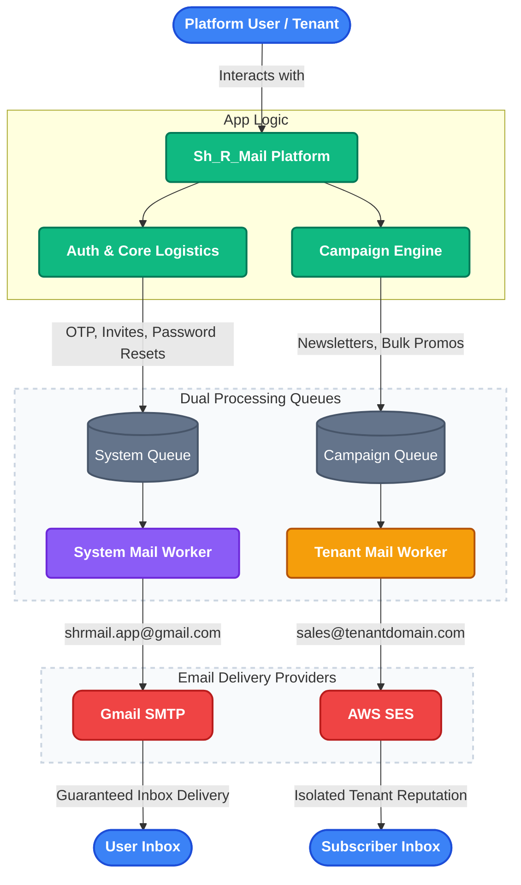

---

## Phase 0 — UI/UX Foundation & Design System
**WHY:** Establishes the visual language, reusable UI primitives, interaction rules, and accessibility baseline before feature work scales.

### Phase 0 Architecture Flow

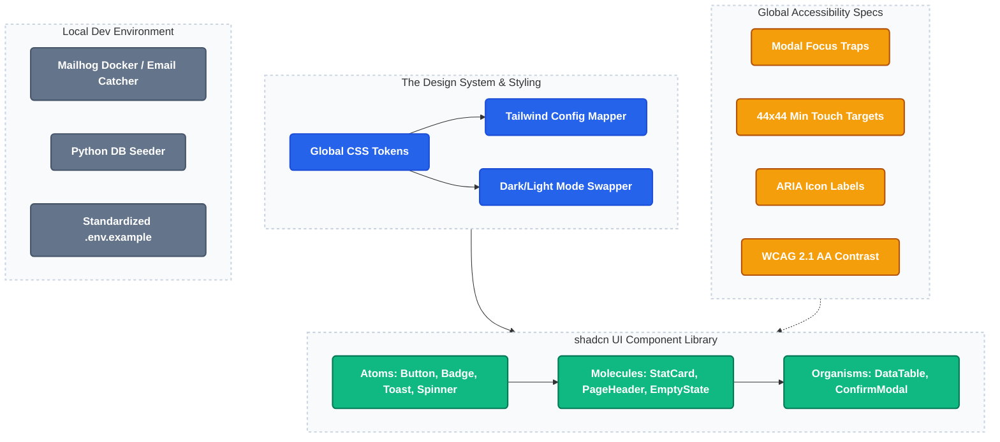

**[BACKEND]**
- Mailhog added to docker-compose for local email testing and debugging.
- Database seed script (`seed_dev_data.py`) for reproducible development states.
- Standardized environment variables fully documented in `.env.example`.

**[FRONTEND]**
- Dark-mode first design tokens in `globals.css` bridged via `tailwind.config.ts`.
- Typography scale and semantic color set defined.
- Reusable UI component library (`Button`, `Badge`, `StatCard`, `DataTable`, `Toast`, `ConfirmModal`, `EmptyState`, etc.).
- Standard page layout pattern: Breadcrumb -> PageHeader -> Stat row -> DataTable -> EmptyState.
- Accessible modal implementations with focus traps, escape-to-close, and visible outlines.
- WCAG 2.1 AA color contrast validation and minimum 44x44px touch-target guidance enforced.

**📋 Planned Tasks — Phase 0**
- shadcn/ui installed and initialized
- Inter font installed in root layout
- Core dark-mode tokens exist in globals.css
- Typography scale is fully defined
- Semantic token set is complete
- App no longer uses hardcoded colors or inline style-heavy UI
- Design Tokens Documentation Page (internal token reference)
- Loading skeletons on all list pages (contacts, campaigns, templates)
- Dark / Light mode toggle (CSS variable swap)
- Button.tsx
- Badge.tsx
- HealthDot.tsx
- LoadingSpinner.tsx
- StatCard.tsx
- StatusBadge.tsx
- ConfirmModal.tsx
- Toast.tsx
- PageHeader.tsx
- DataTable.tsx
- EmptyState.tsx
- Breadcrumb.tsx
- src/components/ui/index.ts
- Tailwind config maps tokens to utility names
- All mapped Tailwind token names resolve to actual CSS variables
- Every destructive action uses ConfirmModal
- Every async form submit uses loading state consistently
- Every API success path uses toast feedback consistently
- Every API error path uses toast feedback consistently
- Every empty list uses EmptyState
- Every list page has consistent search and filter behavior
- Mobile navigation is complete end-to-end
- Remove global *:focus { outline: none }
- Modal accessibility is complete (focus trap + restore)
- Icon-only buttons are fully labeled app-wide
- 44x44 touch-target guidance is satisfied app-wide
- Mailhog added to docker-compose.yml
- scripts/seed_dev_data.py added
- .env.example fully documents all required variables

---

## Phase 1 — Foundation, Auth, Tenant Identity & Onboarding
**WHY:** Before any email can be sent, we need a secure multi-tenant foundation. Every query, row, and action must be strictly isolated by `tenant_id`.

### Phase 1 Architecture Flow

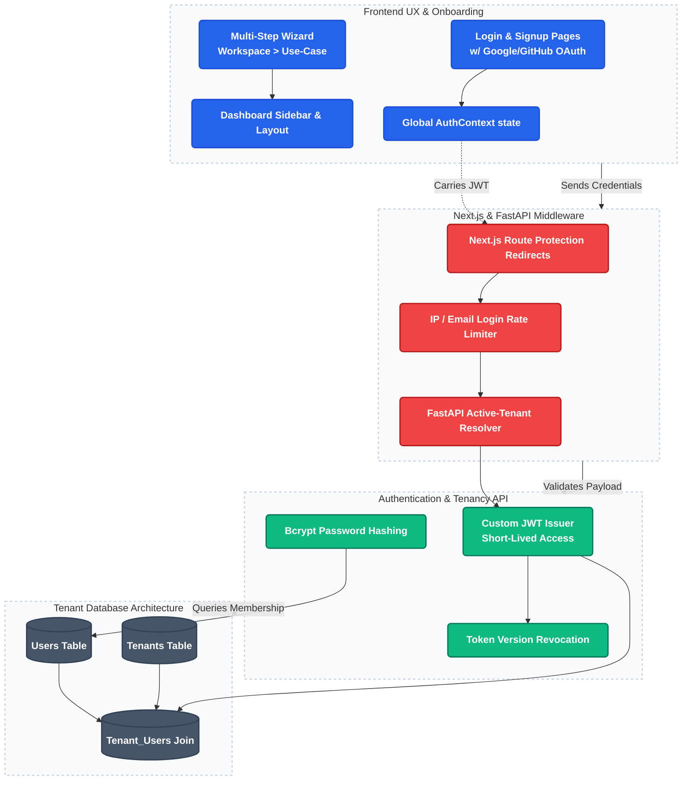

**[BACKEND]**
- Custom email/password auth using bcrypt and JWT validation.
- JWT payloads carry `tenant_id`, `user_id`, `role`, and `email` for rapid authorization.
- Tenant membership model linking `users`, `tenants`, via a `tenant_users` join table.
- Onboarding APIs providing step-by-step wizard endpoints (workspace creation, use-case selection).
- Active-tenant request-time guards verifying valid workspace context.

**[FRONTEND]**
- Modern Login and Signup pages supporting Social Auth (Google/GitHub context).
- Multi-step interactive onboarding wizard (`workspace` -> `use-case` -> `integrations` -> `scale` -> `complete`).
- Sidebar navigation layout governing the dashboard shell.
- Global `AuthContext` distributing verified session state across components.
- Middleware executing route protection and redirecting unauthenticated traffic safely.

**📋 Planned Tasks — Phase 1**
- Custom email/password auth (bcrypt + custom JWT)
- Tenant membership model (users, tenants, tenant_users)
- Onboarding flow (4-step wizard + progressive endpoints)
- JWT middleware (tenant_id, role, email, user_id verification)
- Active-tenant guard exists
- Workspace switching exists
- /auth/me fully implemented
- All onboarding endpoints use JWT-only tenant resolution consistently
- Login page
- Signup page
- reCAPTCHA on Signup form
- Onboarding wizard (workspace > use-case > integrations > scale > complete)
- Interactive onboarding checklist on dashboard
- Sidebar navigation layout
- Auth context exists
- Middleware redirects exist
- Route protection is fully centralized and consistent
- JWT carries tenant identity
- X-Tenant-ID is validated against JWT when used
- Onboarding tenants are blocked from active-tenant routes
- Social Auth (Google, GitHub) via OAuth 2.0
- Rate limiting on login + registration endpoints (per IP, per email)
- Email verification required before onboarding completes
- Short-lived access tokens (15-30 min) + silent refresh tokens
- Token revocation via token_version counter

---

## Phase 1.5 — Auth Hardening & Audit Logging
**WHY:** Secures the core authentication layer and introduces deep observability for crucial tenant actions.

**[BACKEND]**
- Immutable audit log table recording metadata securely (`user_id`, `tenant_id`, `action`, `resource_type`, timestamp). Never logs sensitive email contents or PII lists.
- Log severity levels distinguishing INFO, WARNING, and CRITICAL actions.
- Automated system alerts via Centralized System Emailer triggering when CRITICAL events occur (e.g., massive contact deletion).
- Two-factor auth (TOTP) generation capability for workspace administrators.

**[FRONTEND]**
- Audit log viewer UI component allowing workspace owners to filter team actions chronologically.
- 2FA setup screen rendering secure QR codes and validating TOTP generation.

**📋 Planned Tasks — Phase 1.5**
- Remove custom /auth/forgot-password endpoint
- Remove custom /auth/reset-password endpoint
- reCAPTCHA token verification endpoint/middleware
- Audit logs table (who did what, when, on which record — metadata only)
- Audit log table is write-only / immutable (no UPDATE or DELETE allowed)
- Log severity levels: INFO / WARNING / CRITICAL on every log row
- Auto-alert on CRITICAL log events (bulk delete >1000, suspicious login)
- Configure Supabase Auth SMTP to use shrmail.app@gmail.com
- Fix forgot-password page — Supabase Auth built-in reset email flow
- Fix reset-password page — Supabase Auth password update
- Test: sign up > verify email > login > forgot password > reset
- Audit log viewer with severity filter (INFO / WARNING / CRITICAL)
- MFA via TOTP for workspace admins
- [AUDIT FIX 1] Cross-tenant webhook suppression — add tenant_id filter to _suppress_contact()
- [AUDIT FIX 2] JWT refresh token model — 30-min access token + HttpOnly refresh cookie + token_version revocation
- [AUDIT FIX 3] Lock CORS to FRONTEND_URL env var — no wildcard in production
- [AUDIT FIX 4] Enable SSL cert verification in worker — remove ssl.CERT_NONE
- [AUDIT FIX 5] Delete /contacts/upload + /test-send from main.py; remove dev scripts from repo root
- [AUDIT FIX 6] Remove duplicate events router registration in main.py
- [FRIEND AUDIT FIX 17] OAuth State Parameter — validate random state string in Google/GitHub OAuth flow
- [GAP 1 — System Email Provider Risk] Track daily system email count in Redis key `system:emails:sent:{date}`
- [GAP 1] Auto-trigger CRITICAL audit log when system email count exceeds 1,600/day (80% of Workspace limit)
- [GAP 1] Add `SYSTEM_MAILER=gmail|ses` env flag — abstraction layer for future migration

> ⚠️ **Gmail Risk Note:** `shrmail.app@gmail.com` is capped at ~2,000 emails/day on Workspace. At moderate signup volume (200 users/day triggering welcome + verification = 400 emails/day), this limit will be hit within months. **Migration target: Phase 9 — `mail.shrmail.app` via AWS SES.** See Phase 9 for full plan.

---

## Phase 1.6 — GDPR & Legal Compliance
**WHY:** Ensures the system complies with EU data regulations securely before enterprise deployment.

**[BACKEND]**
- Async data export API generating ZIP files of all tenant contact data using a job queuing system avoiding HTTP timeouts.
- "Right to be Forgotten" endpoint triggering PII anonymization (`deleted@gdpr.invalid`) instead of hard deletion to perfectly preserve aggregate analytics history.
- Soft-delete architectural pattern utilizing `deleted_at` timestamps establishing a 30-day "recycle bin" restoration window.
- Consent tracking capturing import source, exact timestamp, and originating IP upon list ingestion.

**[FRONTEND]**
- Quick data export request functionality in Settings routing download instructions to email.
- Restoration action flows permitting users to undelete soft-deleted items.
- Specific consent and source columns visibly rendered in the contacts data table.

**📋 Planned Tasks — Phase 1.6**
- Data export API (async job — POST > job_id > poll > download ZIP)
- Right to be forgotten: DELETE /contacts/{id}/anonymize (anonymize PII, keep row)
- Soft delete pattern: deleted_at on contacts, campaigns, templates (30-day restore)
- Consent tracking: consent_source, consent_date, consent_ip on contacts
- Data retention policy: auto-flag contacts inactive >24 months for purge
- Consent re-validation: exclude contacts with consent >24 months old
- Do Not Contact (DNC) global suppression list (platform-level, blocks all emails)
- Restore modal for soft-deleted items
- Data export button in Settings
- Consent column visible in contacts table
- Privacy policy / Terms page linked from footer

---

## Phase 2 — Contacts Engine
**WHY:** Contacts are the core dataset. This phase creates a stable, scalable lifecycle for importing, managing, suppressing, and tagging audiences.

### Phase 2 Architecture Flow

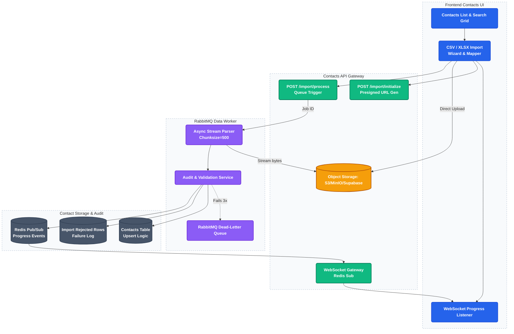

### 🔄 Contacts Import: Deep-Dive Execution Flow

To support gigabyte-scale datasets without memory exhaustion, the import process follows a **Storage-First** and **Queue-Second** distributed pipeline:

1.  **Step 1: Initialization (`POST /import/initialize`)**: The UI requests a Job ID and a **S3/MinIO Presigned URL**. No file data is sent to the API.
2.  **Step 2: Direct-to-Storage Upload**: The Frontend uploads the raw CSV/XLSX directly to the object store. This bypasses API memory entirely.
3.  **Step 3: Signal Process (`POST /import/process`)**: Once the upload is verified, the UI signals the API to enqueue the work.
4.  **Step 4: RabbitMQ Tasking**: The API pushes a metadata message to the `import_tasks` queue.
5.  **Step 5: Distributed Streaming Worker**: 
    - A dedicated worker opens a stream from the object store.
    - It reads content in **chunks of 500 rows** (OOM prevention).
    - It validates each row (Syntax, MX Check, Disposable detection).
    - **Upsert Layer**: Valid contacts are inserted into Postgres; collisions are merged based on tenant_id + email.
    - **Audit Layer**: Failed rows are pushed to `import_rejected_rows` with specific error reasons.
6.  **Step 6: Real-time Progress (WebSockets)**: The worker publishes progress updates to **Redis Pub/Sub**, which are broadcast to the user via the WebSocket Gateway.

### 🚀 Why This Is Better (Old vs New)

| Feature | Old Architecture | NEW Enterprise Architecture |
| :--- | :--- | :--- |
| **Upload Reliability** | API times out on large files | Direct-to-Storage (Impossible to timeout) |
| **Memory Strategy** | Reads entire CSV into RAM (Crashes) | Streams in 500-row chunks (OOM safe) |
| **User Feedback** | "Please wait..." (Static spinner) | Live progress bar with real-time failure stats |
| **Fault Tolerance** | If API restarts, upload is lost | RabbitMQ ensures worker finishes tasks |
| **Data Integrity** | Silently skips errors | Precision Audit Logs for every rejected row |

**[BACKEND]**
- High-performance, streaming CSV/XLSX ingestion running asynchronously via RabbitMQ to support gigabyte-scale datasets.
- Real-time single contact insertion REST API designed for external CRM or web-form integrations.
- Tiered validation sequence rejecting malformed domains and detecting Disposable Email Providers instantly.
- Complex deduplication and append behavior preventing collisions.
- Contact scoring system assigning Engagement Scores (e.g., "Inactive", "Highly Engaged").
- **Smart Data Mapping & Splitting**: Enforce strict JSON key normalization during CSV imports (e.g., mapping "Full Name" to `first_name` and `last_name` via automatic string splitting) to guarantee Merge Tags resolve correctly.

**[FRONTEND]**
- robust Contacts grid implementing native search, sorting, and pagination logic.
- Import modal UI presenting column mapping and visualizing background polling progress.
- Specific status badges illustrating Subscribed, Bounced, or Unsubscribed states.
- Dedicated Suppression List view exposing spam complaints and hard bounces.
- Dynamic segment builder targeting specific field permutations.

**📋 Planned Tasks — Phase 2**
- CSV/XLSX ingestion (Phase 2 Master Refactor)
- POST /contacts/import/initialize (Presigned URL generator)
- POST /contacts/import/process (Signal upload completion)
- Import rejected rows table and audit service (Partial Success logic)
- [x] RabbitMQ Dead-Letter Queue (DLQ) for failed chunks
- WebSocket progress updates via Redis Pub/Sub
- Real-time contact ingestion API (POST /v1/contacts for forms/CRM webhooks)
- Email validation: syntax check + MX record check + disposable email detection
- Contact scoring system (engaged / at-risk / inactive / risky)
- Upload preview endpoint
- Async import job creation
- Dedicated RabbitMQ Import Worker
- Import batch history
- Deduplication (in-memory + Supabase upsert on tenant_id, email)
- Contact status (subscribed, unsubscribed, bounced, complained)
- Domain summary endpoint and email_domain storage
- Batch-scoped domain filtering
- Segmentation filters (filter by field/operator/value)
- Bulk delete
- Contact search endpoint (email, name, tag)
- Contact update endpoint (email + custom fields)
- Tags CRUD API (add/remove/list tags per contact)
- Soft delete: deleted_at column on contacts (restore within 30 days)
- Suppression list API (GET /contacts/suppression)
- Export contacts API
- FIX: GET /suppression route collision with /{contact_id} resolved
- FIX: Suppression list jwt_payload arg bug fixed (was returning 0 results)
- Contacts list page (table with search and pagination)
- Import contacts modal with preview and mapping
- Async import progress polling
- Import history tab
- Batch detail page
- Batch detail domain filtering
- Contact status badges (subscribed / unsubscribed / bounced)
- Segment builder UI (filter by field, value)
- Bulk action buttons (delete selected)
- Contact detail editing (email + custom fields)
- Contact detail page (individual contact activity)
- Export contacts to CSV button
- Tags UI (add/remove tags on contacts)
- Suppression list page (view bounced/spam/unsubscribed contacts)
- Campaign audience selection supports batch-domain targeting
- Campaign audience selection supports multi-domain selection inside a batch
- Duplicate resolution UI (show conflict, let tenant choose which values to keep)
- Contact scoring badge visible in contacts list
- [FRIEND AUDIT FIX 18] Streaming CSV Uploads — Replace pandas in-memory parser with async chunked byte stream parsing

---

## Phase 3 — Template Engine & AI Content Creation
**WHY:** Email content must be responsive, dynamic, and perfectly rendered across extreme client environments (Outlook, Gmail, Apple).

### Phase 3 Architecture Flow

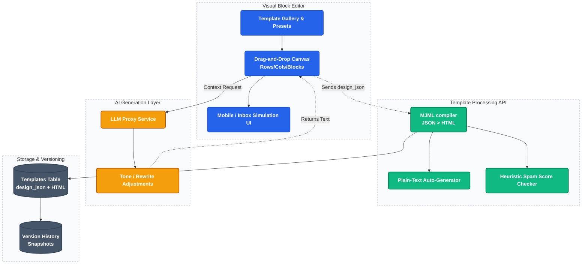

**[BACKEND]**
- Layout preservation logic persistently tracking complex Template JSON constructs.
- MJML processing pipeline compiling abstract blocks into highly compliant render-safe HTML.
- Template versioning creating immutable snapshots for draft restorations.
- Plain-text auto-generation matching HTML changes automatically.
- Email spam heuristic checker rating subject/body language.
- **AI-Assisted Content Generation API**: Backend proxy to LLM endpoints designed to rewrite, adjust tone, or generate email copy dynamically based on tenant prompts.

**[FRONTEND]**
- Visually rich template gallery with selectable preset starting points.
- Interactive structured block editor (Rows -> Columns -> Content Blocks).
- Responsive view toggles forcing desktop vs mobile rendering simulation inside the canvas.
- Inbox preview mode mocking specific visual anomalies of major clients.
- Send test email functionality seamlessly embedding custom merge-tag dummy data.
- **AI Copywriting Assistant UI**: Magic-wand contextual buttons generating subject lines or rewriting paragraphs inline inside the editor canvas.

**📋 Planned Tasks — Phase 3**
- Template CRUD
- Category
- Persist compiled HTML from the active block editor
- Preset gallery and preset-driven template creation
- Template versioning (save history)
- Plain text auto-generator (sync from HTML for spam filters)
- Public View Online link (render template in browser without login)
- Templates list page (grid of template cards with thumbnails)
- Create template (blank canvas and preset entry flow)
- Structured block editor (rows > columns > blocks)
- Server-side compile preview (design_json > MJML > HTML)
- Plain Text (Auto-generated) | Plain Text (Custom) tabs
- Send test email button (enter email address > receive real email)
- Duplicate template button
- Category filter tabs on template list
- Version history panel (see and restore older versions)
- Dynamic placeholder guide (show list of {{merge_tags}} user can use)
- Spam score checker (SpamAssassin-style heuristics before campaign send)
- Mobile preview mode (375px viewport toggle in template editor)
- Inbox preview simulation (Gmail, Outlook, Apple Mail rendering)
- Template Accessibility Scanner (WCAG 2.1 color contrast & alt-text heuristic checks before saving)

---

## Phase 4 — Campaign Orchestration
**WHY:** Orchestrates the core action of filtering audiences, attaching content, validating legality, and queuing dispatches.

### Phase 4 Architecture Flow

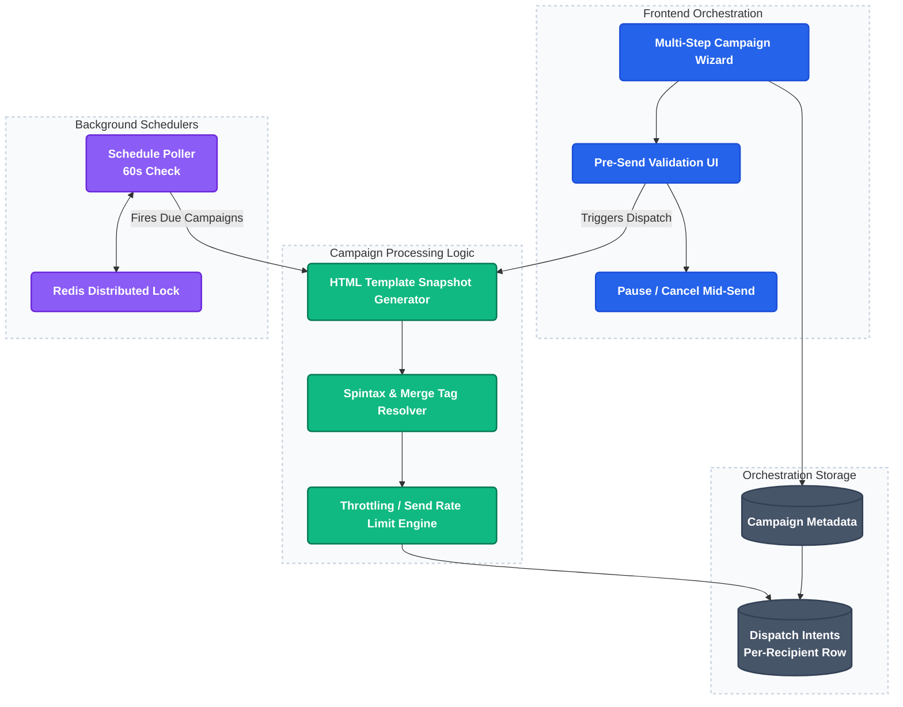

**[BACKEND]**
- Snapshotting logic immutably locking campaign HTML and metadata exactly at send time.
- Spintax capability injecting alternating subject variations and localized merge-tag parsing.
- **Merge Tag Fallback Engine**: Systematically injects default fallback strings (e.g., "Customer") when a personalization token like `{{first_name}}` attempts to map to an empty database field, preventing broken or awkward emails.
- Scheduling engine committing tasks to execution timestamps.
- Dispatch throttling gate controlling total per-minute injection rates preventing SMTP connection flooding.

**[FRONTEND]**
- Multi-step Campaign Creation Wizard sequentially ordering details, audience targeting, content review, and summary checks.
- Pre-send checklist enforcing presence of Unsubscribe links, physical addresses, and blank subjects before enabling the Send action.
- Schedule picker allowing exact timezone-aware delivery planning.
- "Send to 5% sample" interactive switch for risk-free trial runs.
- Instant Pause and Cancel actions surfaced on active dashboard panels.

**📋 Planned Tasks — Phase 4**
- Campaign CRUD (Implemented)
- Campaign wizard (details > audience > content > review) (Implemented)
- Snapshot campaign content + dispatch intents at send time (Implemented)
- Spintax + merge tags (Implemented)
- Scheduled sending (Implemented; dual scheduler consolidation pending)
- Pause/resume/cancel lifecycle (Implemented)
- Resend to unopened contacts (Not implemented; depends on Phase 6 metrics)
- FIX: exclude_suppressed=True enforced in scheduler.py, main.py, campaigns.py (Verified)
- Campaigns list page (status badges, stats) (Implemented)
- Campaign detail page (Implemented)
- Pre-send checklist UI (Implemented)
- Schedule picker (date/time input for scheduled send) (Implemented)
- Pause button / Cancel button on in-progress campaign (Implemented)
- Send test email modal (Implemented; contract fix required)
- Automated pre-send validation (Implemented)
- Send throttling control (Implemented)
- Send to 5% sample first mode (Implemented)
- Fix Step 3 template picker payload mismatch
- Fix duplicate flow required fields
- Normalize frontend API base URLs

---

## Phase 5 — Delivery Engine
**WHY:** Connects the system to the internet via SMTP, automatically responding to bounces, spam complaints, and user unsubscriptions securely.

### Phase 5 Architecture Flow

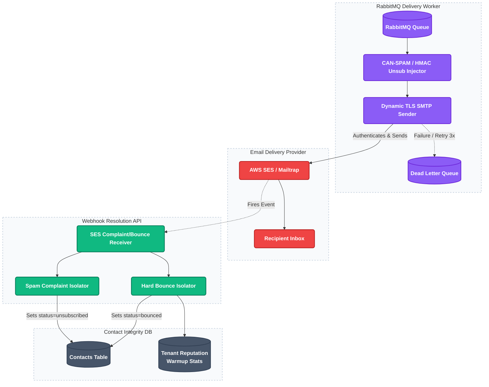

**[BACKEND]**
- RabbitMQ consumer loop maintaining persistent connections, dynamically executing TLS handshakes, and nacking failures into Dead Letter Queues gracefully.
- Legal footer injection statically appending CAN-SPAM compliant company addresses and HMAC-secure unsubscribe tokens.
- Immediate bounce classification logic segregating Soft Bounces (retried exponentially) from Hard Bounces (instantly placed on permanent suppression list).
- Spam complaint webhook ingestion directly suppressing contacts from further dispatches preventing reputation destruction.
- Domain warmup throttler incrementally raising outbound execution limits across 30 days.
- Tenant reputation tracking evaluating 30-day rolling bounce/spam statistics against critical suspension thresholds.

**[FRONTEND]**
- Clean Unsubscribe landing page capturing voluntary removal events effortlessly.
- Re-subscribe form confirming reversal of accidental unsubscribes.

**📋 Planned Tasks — Phase 5**
- Worker loop (RabbitMQ consumer)
- SMTP send via Mailtrap/SES
- Dynamic SMTP TLS Handshake based on active Port (587 support)
- Retry + dead-letter queue (nack on failure)
- Unsubscribe link injected into every email (HMAC-signed token)
- Physical business address in email footer (CAN-SPAM compliant)
- Hard bounce > auto-mark contact as bounced (SES webhook)
- Spam complaint > auto-mark contact as unsubscribed (SES webhook)
- Daily send limit enforcement (per-tenant, resets at midnight, 429 on breach)
- All dispatch paths enforce exclude_suppressed=True
- Bounce classification: hard bounce suppresses, soft bounce retries 3x
- Domain warmup automation (graduated daily limit increase over 30 days)
- Send reputation scoring per tenant (auto-throttle on >2% bounce/>0.1% complaint)
- FIX: Unsubscribe event logged to email_events with correct tenant_id
- FIX: Re-subscribe sets status to 'subscribed' (was 'active')
- FIX: Re-subscribe API uses NEXT_PUBLIC_API_URL (CORS resolved)
- /unsubscribe as a public route (no sidebar/header)
- Unsubscribe page: auto-close tab after 3 seconds + Close Window button
- Re-subscribe option on unsubscribe page
- Re-subscribe page: auto-close tab after 3 seconds + Close Window button
- [AUDIT FIX 7] Soft vs hard bounce classification — parse SES bounceType
- [AUDIT FIX 8] Real rolling bounce rate writer — write tenant:{id}:bounces:rolling to Redis
- [AUDIT FIX 9] Move scheduler to standalone worker/scheduler.py — Redis SET NX EX 90 distributed lock
- [FRIEND AUDIT FIX 19] Batch DB Updates in Worker — Refactor email_sender.py to batch dispatch row updates
- [FRIEND AUDIT FIX 20] Native DB Connection — Switch worker from Supabase PostgREST HTTP client to asyncpg TCP connection pool
- [GAP 3 — Token Bucket Rate Limiter] Redis `tenant:{id}:send_tokens` hash — refill rate per plan (Free: 60/min, Starter: 600/min, Pro: 3,000/min, Enterprise: 18,000/min)
- [GAP 3] Worker checks token bucket BEFORE each send; sleeps 0.5s if empty (never drops message)
- [GAP 3] SES `ThrottlingException` handler with exponential backoff (1s → 2s → 4s → 8s)
- [GAP 3] `emails_per_minute` configurable per tenant via plan defaults (stored in `plans` table)
- [GAP 3] Campaign ETA calculator: `(remaining_dispatch_count / rate_limit_per_min)` exposed in campaign detail UI
- [GAP 5 — Worker Decomposition Phase 1] Split `email_sender.py` (SMTP consumer) from `webhook_handler.py` (SES SNS bounce/complaint processor) — two separate processes
- [GAP 7 — Bounce Classification Matrix] Parse `bounceType` + `bounceSubType` from SES SNS notification payload
- [GAP 7] Permanent / NoEmail / MailboxDoesNotExist → IMMEDIATE suppress (no retry)
- [GAP 7] Transient / MailboxFull → retry 3× over 24h with 8h intervals
- [GAP 7] Transient / MessageTooLarge → mark event, skip (unsendable regardless of retries)
- [GAP 7] Transient / ContentRejected or AttachmentRejected → mark event, send CRITICAL audit alert to tenant
- [GAP 7] Transient / General → retry 3× over 72h
- [GAP 7] Undetermined / General → retry 2×, then escalate to CRITICAL audit log
- [GAP 7] Complaint (any subtype) → immediate unsubscribe (`status = 'unsubscribed'`)
- [NEW] Recipient Preference Center (Granular topic-based opt-outs instead of global unsubscribe)

> 💡 **Worker Architecture Note (Gap 5):** This phase creates the initial worker. Full microservice decomposition into 5 focused workers (sender, webhook-handler, reputation-worker, warmup-scheduler, dispatch-logger) happens in **Phase 13**.

---

## Phase 5.5 — Event Data Archival Strategy (Gap 4)
**WHY:** A 100k-recipient campaign instantly creates 100k+ rows. Over 1 year, the `email_events` table will grow to 100M+ rows, catastrophically degrading query performance. We must construct a tiered database isolation model immediately after launch.

**[BACKEND]**
- **Table Partitioning:** Refactor the primary `email_events` table using PostgreSQL `PARTITION BY RANGE (occurred_at)`.
- **Auto-Partitioning CRON:** Automated job executing monthly to dynamically generate the next chronological partition table (e.g., `email_events_2025_03`).
- **Data Pruning Preparation:** Establish the foundational schema required for Phase 13's ClickHouse rollout (90-day PostgreSQL retention window).

**📋 Planned Tasks — Phase 5.5 (Event Archival)**
- [GAP 4 — Event Archival Strategy] Refactor `email_events` schema to use `PARTITION BY RANGE (occurred_at)`
- [GAP 4] Write PL/pgSQL function to auto-generate monthly partition tables
- [GAP 4] Set up pg_cron (or worker CRON) to execute partition generation on the 25th of every month
- [GAP 4] Scope all campaign analytic queries to explicitly utilize `occurred_at` indexes for partition pruning
- [NEW] Campaign Health Early Warning System (Auto-pause RabbitMQ dispatch queue if hard bounce rate spikes early)

---

## Phase 6 — Observability & Analytics (Heatmaps & Time Tracking)
**WHY:** Displays critical performance markers allowing users to judge campaign effectiveness accurately.

### Phase 6 Architecture Flow

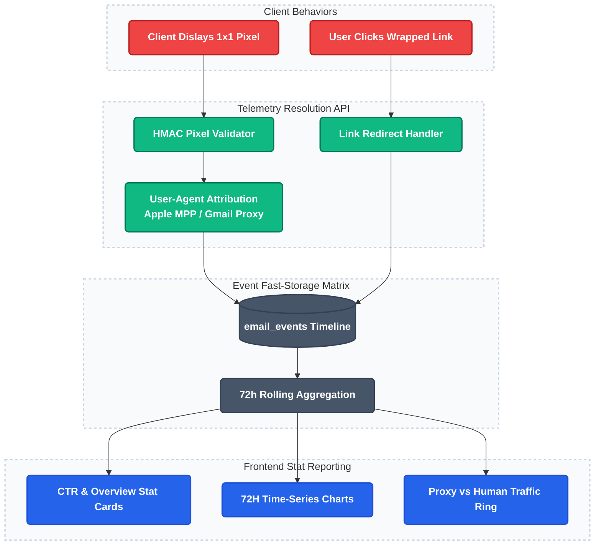

**[BACKEND]**
- 1x1 image pixel endpoint logging secure opens, guarded by heuristic Bot Detection rules distinguishing Google/Apple privacy proxies from malicious scanners or true humans.
- Click tracking honeypots dropping bots mimicking link engagement.
- Stats aggregation routines executing asynchronously to compile real-time summaries.
- **Time Spent Tracking Calculation**: Multi-ping pixel tracking logic classifying the duration a recipient hovered over the message.
- **Click Heatmap Calculation Job**: Aggregation engine correlating click event URLs directly back to their DOM position in the exact sent template.

**[FRONTEND]**
- Detailed Campaign Analytics Dashboard exhibiting exact unique open, click, and bounce matrices.
- Recipient timeline exposing chronological interactions per individual contact.
- Time Series graph plotting engagement velocity across the immediate 72 hours post-send.
- **Click Heatmap Overlay Presentation**: Visually injecting heat maps directly onto the template preview canvas illustrating intense link engagement locations.
- **Engagement Duration Card**: UI stat displaying average read times effectively.

**📋 Planned Tasks — Phase 6**
- Open tracking pixel endpoint (HMAC-signed) via Supabase Edge Function
- Click tracking intentionally disabled (cost optimization)
- SES bounce/complaint webhooks captured natively (bypass Edge Functions)
- Stats aggregation (sent, opens, bounces, unsubscribes per campaign)
- Source attribution (gmail_proxy, apple_mpp, outlook, yahoo, scanner, human)
- FIX: Unsubscribes count cross-checks live contact status (re-subscriptions drop count)
- Contact activity log (recipient timeline in analytics API)
- Optional per-campaign click tracking (opt-in, stored in email_events)
- CTR stat card when click tracking enabled (unique clicks / unique opens)
- Engagement over time graph (opens/bounces/unsubs by hour, first 72h)
- Campaign analytics page (Sent, Opens Unique, Opens Total, Bounces, Unsubscribes)
- FIX: Recipient Activity 'Unsubscribed' column reflects live contact status
- Proxy/Scanner breakdown panel (Gmail, Apple MPP, Outlook, Yahoo, Human)
- FIX: Human-filtered toggle removed — all signals shown natively
- Dashboard homepage sender health widget
- Export analytics as CSV / PDF summary
- [NEW] Direct Feedback Widgets (Interactive 1-5 Star/Yes-No embedded tracking parameters in footers)
- [GAP 2 — Click Tracking Architecture Fix] `campaigns.click_tracking_enabled` BOOLEAN column (default: `False`)
- [GAP 2] Plan gate: only `plan IN ('pro', 'enterprise')` may enable click tracking on a campaign
- [GAP 2] Worker: conditionally wraps links via `https://trk.shrmail.app/c/{hmac_signed_token}` in MJML compile step when `click_tracking_enabled=True`
- [GAP 2] CTR stat card (`unique_clicks / unique_opens`) rendered ONLY when `click_tracking_enabled=True`
- [GAP 2] Click Heatmap Overlay (Phase 10) depends on `click_tracking_enabled=True` data being present
- [GAP 2] Free/Starter plans see an upgrade prompt when hovering the disabled click tracking toggle

> 📌 **Click Tracking Design Decision:** Click tracking is intentionally OFF by default for cost and simplicity (Free/Starter). It is a **Pro/Enterprise feature**. This resolves the contradiction between "disabled for cost" and "CTR/heatmaps available" — both can be true when gated by plan.

---

## Phase 7 — Plan Enforcement & Billing
**WHY:** Regulates computational exhaustion, prevents abuse, and ties usage directly to recurring revenue tiers.

### Phase 7 Architecture Flow

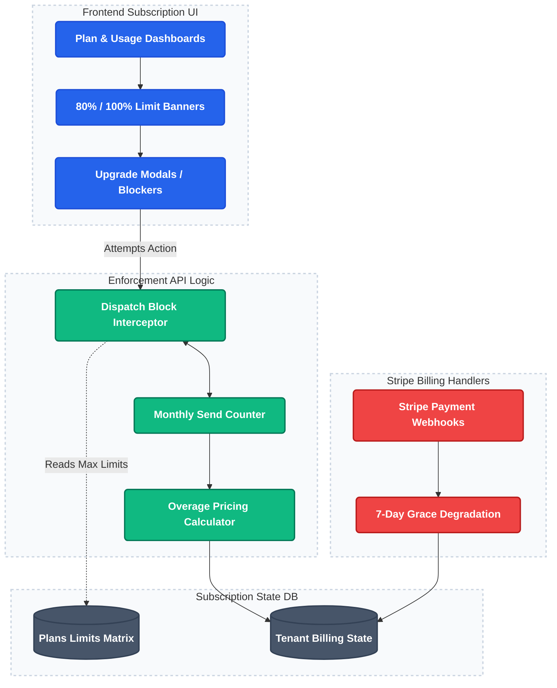

**[BACKEND]**
- Quota limiting services tracking precise daily and monthly volumetric outputs per tenant against defined tier maximums.
- Overage pricing intercept logic preventing hard-blocks while securely calculating micro-payments for excess bursts.
- Billing state watcher gracefully degrading system access rather than violently deleting instances upon payment failure.
- Auto-pause directives halting massive campaigns if quotas breach mid-flight.

**[FRONTEND]**
- Beautiful Plan & Usage page projecting consumption visuals natively via animated progress bars.
- Strategic warning banners displaying precisely at 80% usage and 100% capacity triggers.
- Blocking overlays actively freezing specific forms when quotas permanently prevent initiation.

**📋 Planned Tasks — Phase 7**
- Plans table (free/starter/pro/enterprise with limits)
- Monthly email sent counter per tenant
- Block sends when quota exceeded
- Contact count limit enforcement
- 80% quota trigger (notification)
- Worker-triggered email notifications via Centralized System Emailer
- Plan & Usage page (progress bars for emails + contacts vs limit)
- Upgrade plan modal (plan comparison table)
- In-app banner when 80% quota reached
- Blocked send page when quota maxed
- 14-day free trial with Pro limits (no credit card required)
- Overage pricing instead of hard blocking (per-email rate above quota)
- Auto-downgrade to Free tier on subscription lapse (pause, not delete campaigns)
- Grace period on failed payment (7 days, escalating reminder emails)
- [AUDIT FIX 10] Wire quota gate to queue_campaign_dispatch()

---

## Phase 7.5 — Infrastructure & DevOps
**WHY:** Solidifies architectural foundations ensuring deployment stability, fault tolerance, and developer sanity.

### Phase 7.5 Architecture Flow

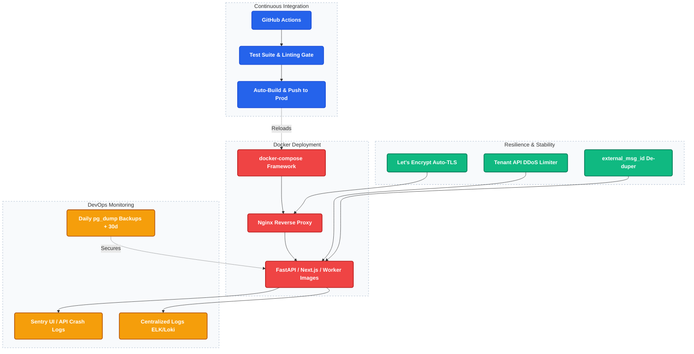

**[BACKEND]**
- Docker orchestration wrapping APIs, Frontend frameworks, Queues, and Caches synchronously.
- Nginx configuration restricting ports and terminating SSL properly.
- Strict API Rate limiter specifically keying on `tenant_id` to prevent single-tenant database DOS attacks.
- Background Job Status synchronization allowing decoupled UI systems to query asynchronous progression globally.
- Error interception hooks funneling unhandled exceptions directly into centralized monitoring stations (Sentry).

**[FRONTEND]**
- Stringent Content-Security-Policy responses blocking inline execution preventing cross-site scripting natively.
- UI Toasts dynamically connected to generic job endpoints simulating real-time progress for heavy tasks.

**📋 Planned Tasks — Phase 7.5**
- Docker (Dockerfiles for API, worker, client)
- Docker Overhaul (Split workers, Standalone client, Env Alignment)
- docker-compose.yml
- Nginx config
- SSL/HTTPS (Let's Encrypt guide in docs)
- CI/CD pipeline (GitHub Actions)
- Load & Spam Testing Setup (k6 + Mail-Tester integration)
- Security Headers & Content Security Policy for all pages
- API Rate Limiting (per-tenant, per-endpoint, burst protection)
- Background Job Status Table (CSV import, GDPR export, campaign send)
- Worker concurrency safety (locked_by column to prevent zombie tasks)
- Idempotency guard (external_msg_id to prevent double-sends on retry)
- GET /health on FastAPI (db + worker status)
- GET /health on Worker (queue depth, last processed)
- Centralized structured logging (ELK stack or Grafana Loki)
- Sentry error tracking on FastAPI + Next.js frontend
- Database backup strategy (daily, 30-day retention, monthly restore drill)
- [AUDIT FIX 11] Uncomment Nginx block in docker-compose.yml; close ports 8000 and 3000 from public network
- [AUDIT FIX 12] GitHub Actions CI/CD pipeline — lint + test + Docker build + deploy on merge to main
- [AUDIT FIX 13] git rm frnds_contacts.csv, testmail_contacts.csv, platform/api/app.db; add *.csv and *.db to .gitignore
- [FRIEND AUDIT FIX 21] Dynamic Config Loading — Replace Path(__file__) .env loading with robust config.py / pydantic-settings

---

## Phase 8 — Account Settings & Administration
**WHY:** Enables self-serve technical configuration for tenants removing the need for manual support intervention.

### Phase 8 Architecture Flow

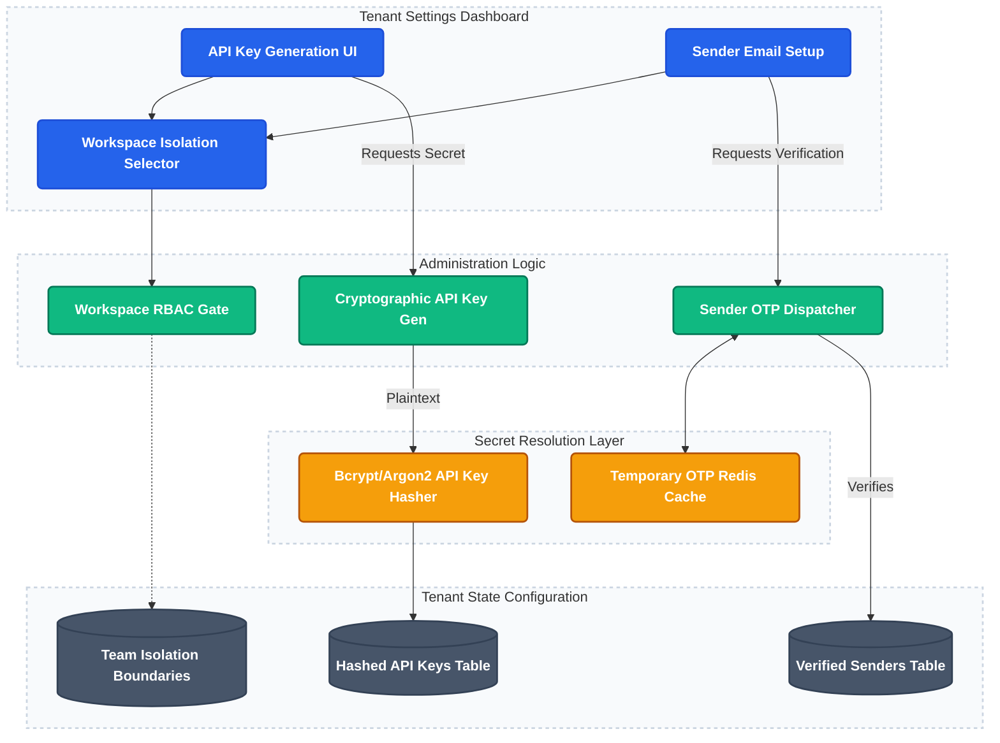

**[BACKEND]**
- Secure sender verification logic dispatching short-lived OTP tokens confirming access over custom sender addresses.
- API Key management infrastructure storing hashes rather than plain text.
- Team workspace isolation logic respecting `team` vs `agency` data boundary matrices.
- Fine-grained role evaluation checks separating Viewer, Operator, Manager, and Admin actions cleanly.

**[FRONTEND]**
- Organizational configuration sub-panels modifying required CAN-SPAM geographical details natively.
- Sender Identity Verification wizard visually explaining complex SPF/DKIM/DMARC DNS insertions succinctly.
- Member invitation flow rendering distinct role assignment dropdowns intuitively.
- Comprehensive API Dashboard detailing exact daily consumption and tracking rejection trends visually.

**📋 Planned Tasks — Phase 7.6 (Testing & Codebase Hardening)**
- [AUDIT FIX 14] Automated test suite — 20 priority tests: auth signup/login, _suppress_contact tenant isolation, unsub token roundtrip, dispatch contact count, quota gate, bounce classification
- [AUDIT FIX 15] Migration file renumbering — resolve duplicate 012_* and 013_* filenames for safe fresh deployment
- [AUDIT FIX 16] Remove dead Clerk config — delete CLERK_SECRET_KEY and CLERK_PUBLISHABLE_KEY from docker-compose.yml and .env.example
- [FRIEND AUDIT FIX 22] Repository Pattern / DAL — Abstract direct Supabase queries out of controllers into services/db.py
- [FRIEND AUDIT FIX 23] Monolithic Worker Refactor — Split email_sender.py into modular layers (parsing, sending, injection, logging)
- [FRONTEND] Performance: Abort stale fetches on domains/team/contacts and Next 16 sync params fixing

**📋 Planned Tasks — Phase 8**
- Settings landing page (/settings) with navigation cards
- Secure sender verification logic dispatching short-lived OTP tokens
- API Key management infrastructure storing hashes rather than plain text
- Team workspace isolation logic (team vs agency data boundary matrices)
- Fine-grained role evaluation checks (Viewer, Operator, Manager, Admin)
- Organizational configuration panels for CAN-SPAM geographical details
- Sender Identity Verification wizard (SPF/DKIM/DMARC DNS instructions)
- Member invitation flow with role assignment dropdowns
- API Key generation and revocation UI

---

## Phase 9 — Security, Compliance & Deliverability Infrastructure
**WHY:** Ensures emails reach the inbox natively without landing in spam, maintaining strict data compliance and backup integrity.

### Phase 9 Architecture Flow

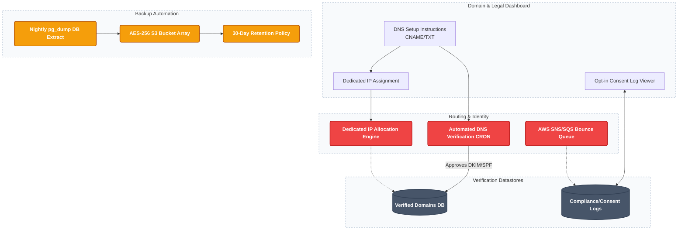

**[BACKEND]**
- Dedicated IP Allocation engine attaching isolated IPs per high-tier tenant.
- Automated DNS Verification CRON constantly scanning CNAME/TXT records for DMARC/SPF/DKIM validity.
- Bounce & Spam complaint SNS/SQS queue ingestion.
- Nightly `pg_dump` backups natively pushing AES-256 encrypted payloads to S3 with 30-day retention policies.

**[FRONTEND]**
- DNS Setup Instructions rendering exact copy-paste values for external providers natively.
- Dedicated IP health monitoring widget.
- GDPR Compliance / Opt-in consent log viewer.

**📋 Planned Tasks — Phase 9**
- SaaS Pricing Localization (transition to INR & RBI-compliant structure)
- Stripe integration with webhook-driven plan updates
- Custom domain setup wizard (enter domain > get DNS records > verify)
- Dedicated IP Allocation engine per high-tier tenant
- Automated DNS Verification CRON (CNAME/TXT for DMARC/SPF/DKIM)
- Bounce & Spam complaint SNS/SQS queue ingestion
- Nightly pg_dump backups pushed AES-256 encrypted to S3 (30-day retention)
- DNS Setup Instructions rendering copy-paste values for external providers
- Dedicated IP health monitoring widget
- IP warmup status page (daily send limit and progression)
- [GAP 1 — System Email Migration] Register and verify `mail.shrmail.app` via AWS SES
- [GAP 1] Migrate all system emails (OTP, audit alerts, notifications) off Gmail MVP onto `mail.shrmail.app`
- [GAP 6 — Dedicated IP Warmup] Implement 30-day warmup automation CRON (`warmup_scheduler.py`)
- [GAP 6] Days 1–3: 50 emails/day cap
- [GAP 6] Days 4–7: 200 emails/day cap
- [GAP 6] Days 8–14: 500 emails/day cap
- [GAP 6] Days 15–21: 1,000 emails/day cap
- [GAP 6] Days 22–30: 5,000 emails/day cap
- [GAP 6] Day 31+: Full capacity granted conditionally (bounce < 2%, complaint < 0.1%)

---

## Phase 10 — Advanced Campaigns & Knowledge RAG Bot
**WHY:** Deep automation workflows and intelligence mechanisms dramatically optimizing open rates naturally.

### Phase 10 & 10.5 Architecture Flow (Advanced Campaigns & Deep RAG)

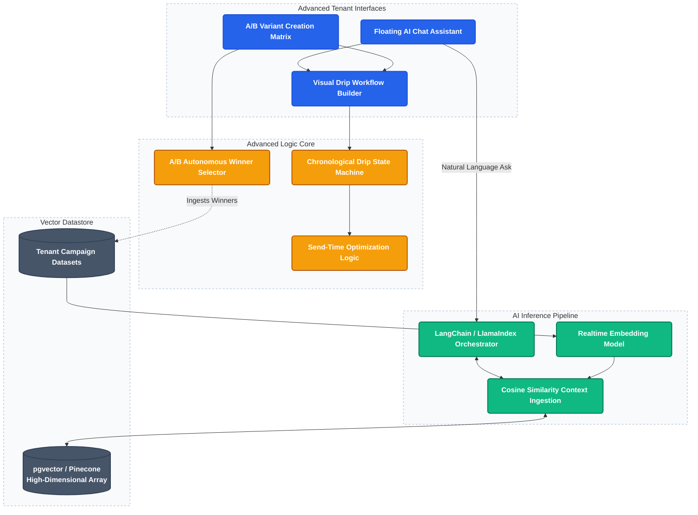

**[BACKEND]**
- Audience A/B split logic partitioning recipients evenly and identifying open-rate winners autonomously.
- Drip campaign orchestration routing logic based on predefined chronological state machines.
- Send-time optimization evaluating historical recipient logs and distributing emails perfectly to the exact peak individual window.
- **Knowledge RAG Bot Service**: Advanced Vector-Database connection (Retrieval-Augmented Generation) continuously indexing the tenant's exact successful templates, tone definitions, and audience responses mathematically.

**[FRONTEND]**
- Multi-variant A/B creation UI integrating directly inside the campaign builder cleanly.
- Visual canvas implementing drag-and-drop conditions creating Drip automated sequence flows.
- **Strategy Chatbot RAG Widget**: Sliding sidebar chatbot specifically contextualized on the tenant's data enabling advanced interrogations ("Write me a follow-up heavily replicating the absolute best subject line we utilized in Q2").

**📋 Planned Tasks — Phase 10**
- A/B Testing: Two subject line variants sent to a split audience, winner auto-sent
- Audience A/B split logic partitioning recipients (open-rate winner auto-selected)
- Drip campaign orchestration via chronological state machines
- Predictive Send-Time Optimization (Machine Learning algorithm determining peak individual inbox-checking minute)
- Visual canvas drag-and-drop Drip sequence builder
- Multi-variant A/B creation UI inside the campaign builder
- Knowledge RAG Bot Service (Vector DB + LangChain orchestrator)
- Semantic Search API (natural language > cosine-similarity search)
- LLM Orchestration Layer (LangChain/LlamaIndex grounded responses)
- Global AI Assistant Widget (floating chat module with conversation history)
- Prompt Library UI (curated starter questions)
- Segment / Filter Generator (natural language input auto-configures filters)
- Deliverability Explainer Modal ("Explain this" button for SMTP bounce codes)
- pgvector / Pinecone high-dimensional embedding store setup
- Data Ingestion Pipeline (embed successful campaign HTML/subjects asynchronously)

---

## Phase 10.5 — AI & Deep RAG Integration
**WHY:** Transforms the platform from a manual sending tool into an intelligent marketing assistant leveraging the tenant's own historical data.

**[BACKEND]**
- **Vector Database Provisioning**: Setup pgvector (or Pinecone) to store high-dimensional embeddings.
- **Data Ingestion Pipeline**: Asynchronously chunk and embed successful campaign HTML, subject lines, and send-time metrics every time a campaign completes.
- **Semantic Search API**: Endpoint taking natural language queries, embedding them, and performing cosine-similarity searches against the tenant's vector namespace.
- **LLM Orchestration Layer**: LangChain/LlamaIndex implementation processing retrieved context and generating grounded responses without hallucinations.

**[FRONTEND]**
- **Global AI Assistant Widget**: Floating chat module available across all pages maintaining conversation history.
- **Prompt Library UI**: Curated list of starter questions ("Analyze my last 3 campaigns", "Generate a segment for unengaged users").
- **Segment / Filter Generator**: Natural language input box on the Contacts page that auto-configures complex dropdown filters based on AI interpretation.
- **Deliverability Explainer Modal**: "Explain this" button next to raw SMTP bounce codes that opens an AI-generated, plain-English summary of the exact fix needed.
- **Multi-Language "Smart Translation"**: Allow user to draft a template and instantly generate localized copies for international scaling.

---

## Phase 11 — API & Integrations
**WHY:** Creates extreme extensibility via headless consumption and outgoing system webhooks.

### Phase 11 Architecture Flow

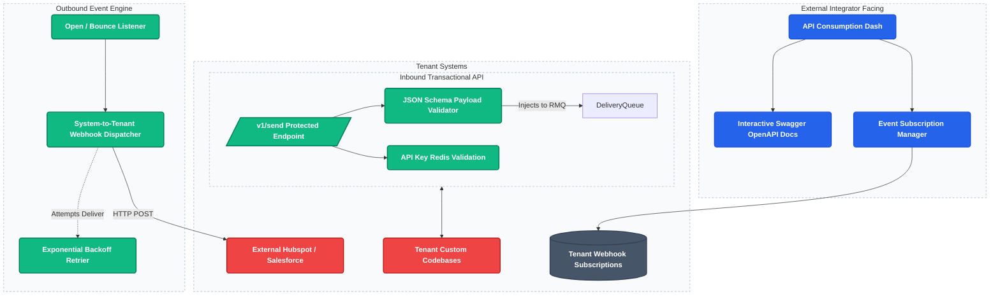

**[BACKEND]**
- Dedicated `/v1/send` REST API architecturally prioritizing transactional payload executions reliably.
- Webhook notification engine repeatedly attempting (via exponential backoff) to alert external tenant interfaces upon open/click/bounce milestones.

**[FRONTEND]**
- Developer portal natively hosting interactive OpenAPI documentation components cleanly.
- Webhook management interface facilitating specific event subscriptions visually.

**📋 Planned Tasks — Phase 11**
- A public REST API (/v1/send) for transactional email sending
- /v1/send endpoint with JSON Schema payload validation
- API Key Redis validation (authentication for external callers)
- Webhook notification engine with exponential backoff retrier
- Event subscription system (open, click, bounce, unsubscribe events)
- Webhook Subscription Manager UI
- Interactive Swagger OpenAPI documentation portal
- API Consumption Dashboard (daily usage, rejection trends)
- HubSpot / Salesforce CRM outbound webhook delivery

---

## Phase 12 — Enterprise Domain Auto-Discovery (JIT Provisioning)
**WHY:** Reduces extreme onboarding friction for massive organizations via automatic corporate-domain correlation.

### Phase 12 Architecture Flow

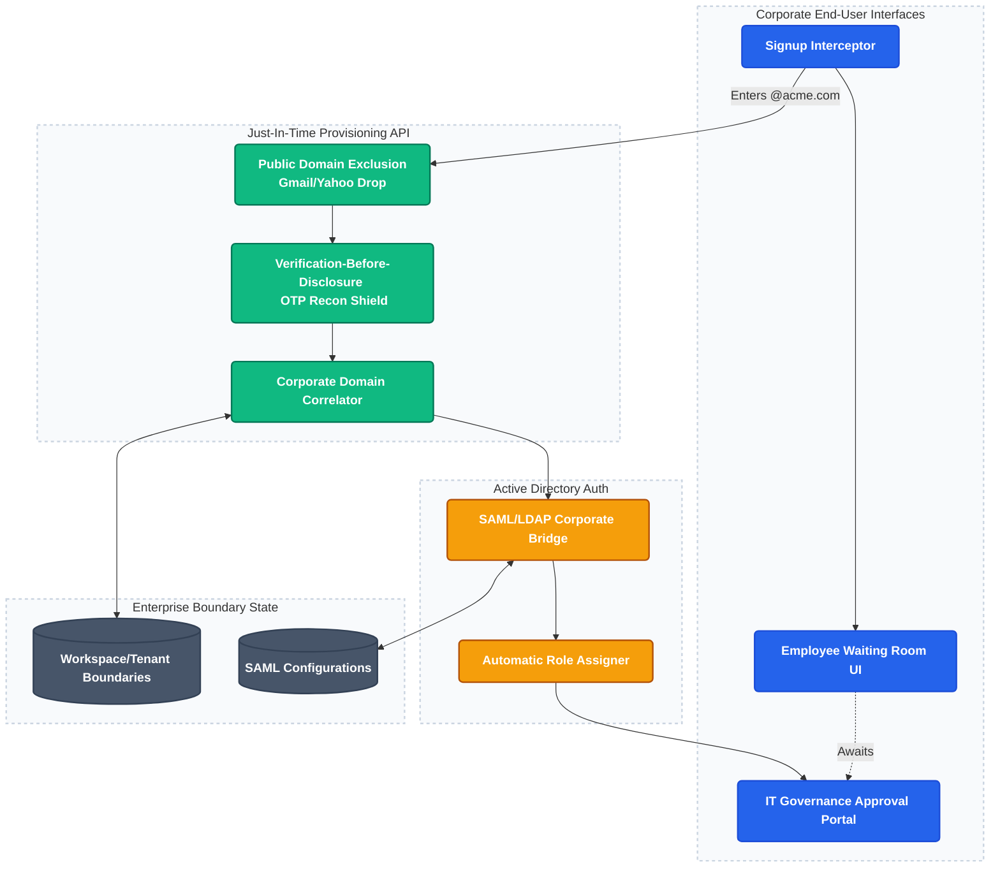

**[BACKEND]**
- JIT provisioning processor intercepting recognized corporate domains reliably.
- PDEP Filter aggressively blocking free providers (Gmail, Yahoo) from discovery mechanisms.
- VBD (Verification-Before-Disclosure) forcing OTP entry identically before confirming domain existence preventing reconnaissance.
- Active Directory SSO integrations via secure SAML/LDAP bridges mapping user roles reliably.

**[FRONTEND]**
- Custom waiting room interfaces reassuring unapproved employees cleanly.
- Governance Portal rendering direct approval matrices prioritizing swift IT Administrator workflow ingestion natively.

**📋 Planned Tasks — Phase 12**
- Custom domain setup wizard (enter domain > get DNS records > verify)
- JIT provisioning processor — intercepts recognized corporate domains
- PDEP Filter — blocks free providers (Gmail, Yahoo) from discovery
- VBD (Verification-Before-Disclosure) — requires OTP before confirming domain existence
- Active Directory SSO integrations via SAML/LDAP bridges
- Custom waiting room UI reassuring unapproved employees
- IT Governance Portal with approval matrix for administrators
- Automatic Role Assigner via RBAC post SSO login
- SAML Configuration storage per enterprise tenant

---

## Phase 13 — Scale & Microservices
**WHY:** Separating bounded contexts logically when extreme transaction volumes demand independent scaling axes natively.

### Phase 13 Architecture Flow

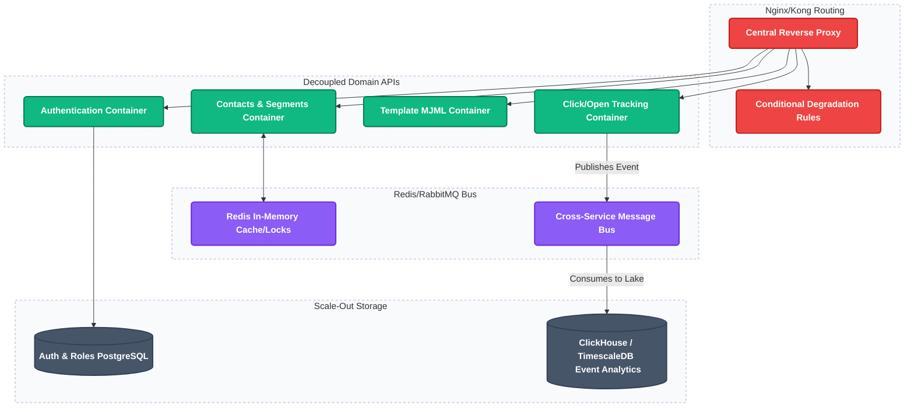

**[BACKEND]**
- Complete decomposition partitioning Auth, Contacts, Delivery, Templates, and Analytics functionally across separated containers.
- Message bus replacements upgrading database-polling directly into Redis-backed asynchronous workers natively.
- Blacklist verification CRON continuously pinging MXToolbox API monitoring IP health perpetually.

**[FRONTEND]**
- Degraded-state conditional rendering preserving essential UI functionality even when sub-scale internal matrices disconnect slightly (e.g. allowing editing while analytics systems update).

**📋 Planned Tasks — Phase 13**
- Complete decomposition: Auth, Contacts, Delivery, Templates, Analytics into separate containers
- Message bus replacement (database-polling > Redis-backed async workers)
- Horizontal worker scaling (stateless workers, Docker Swarm / k8s replicas)
- Circuit breaker on SES SMTP (fail fast on consecutive failures, auto-reset)
- Blacklist verification CRON (MXToolbox API monitoring IP health)
- Nginx/Kong API Gateway with conditional degradation rules
- Platform health dashboard (Redis queue depth, worker status)
- Cost monitoring dashboard (per-tenant SES cost vs plan revenue)
- ClickHouse / TimescaleDB event analytics lake migration
- Degraded-state UI conditional rendering (allow editing while analytics updates)
- [GAP 4 — Event Archival Strategy] Migrate `email_events` > 90 days old from PostgreSQL to ClickHouse
- [GAP 4] Rewrite analytics frontend queries to route historical trends (> 90d) to ClickHouse
- [GAP 5 — Worker Decomposition Phase 2] Split Monolith into 5 dedicated micro-workers
- [GAP 5] `email_sender.py` (Scales horizontally, purely pulls from queue and sends to AWS SES)
- [GAP 5] `webhook_handler.py` (Ingests SNS bounce/complaint webhooks, scales horizontally)
- [GAP 5] `reputation_worker.py` (Single-instance, aggregates bounce events into tenant rolling scores)
- [GAP 5] `warmup_scheduler.py` (Single-instance CRON, advances daily IP limits)
- [GAP 5] `dispatch_logger.py` (Batches successful sends into `email_events` database inserts optimally)

---

## Notification Strategy

**In-App (Toast/Banner UI)**
- Campaign dispatched, Campaign paused, SMTP error warnings, Quota limit alerts, Daily list validations.

**System Emails (Sent via Centralized System Emailer)**
- Sender Identity OTPs, Campaign completion analytical summaries, Password resets, Payment failed alerts, Monthly usage recitals.

**System/Legal Emails (Appended internally to every dispatched campaign)**
- Clean un-subscription notifications natively respecting external click intercepts securely.
- Mandatory CAN-SPAM/GDPR entity address placements enforcing platform legality completely.

---

## Database Index Strategy (Critical for Scale)
- `contacts(tenant_id, email)` — Fast deduplication.
- `email_tasks(status, scheduled_at)` — Ultra-fast worker polling.
- `campaigns(tenant_id, status)` — Fast dashboard loading.
- `audit_logs(tenant_id, timestamp)` — Fast compliance fetching.
- `email_events(campaign_id, contact_id)` — Fast analytical aggregations.
- `sender_identities(verification_token)` — Secure fast-lookups during identity validation.
