# Email Engine — Complete Phase Plan

> This document is the **strategic planning guide** for the Email Engine platform.
> It describes what each phase is, why it exists, what it covers, and the technical architecture behind it.
> Progress tracking (what is done vs. pending) lives in the **interactive HTML tracker** (`docs/progress.html`).
> Live URL: https://rahul-pamula.github.io/Sh_R_Mail/progress.html (redirect available at https://rahulpamula.me/Sh_R_Mail/)

Each phase is divided into TWO parts:
  [BACKEND] — API, database, worker logic
  [FRONTEND] — Pages, components, UX flows

---

## 🏗 CRITICAL ARCHITECTURE: DUAL EMAIL ENGINE

Before phases — explain this first:

Our system sends two completely different types of emails:

1. **System Emails** — OTPs, welcome emails, team invites, password reset → sent via `shrmail.app@gmail.com` (Gmail SMTP) — almost always lands in the inbox because Gmail has a trusted reputation.
2. **Campaign Emails** — Bulk newsletters to thousands of subscribers → sent via the tenant's own verified domain (e.g. `sales@theircompany.com`) via **AWS SES** — isolates sender reputation per tenant.

> **Why this matters:** This design means even if one tenant's campaign has deliverability issues or spam complaints, it never affects our platform's ability to deliver critical OTPs and system alerts to another user.

### Architecture Flow

---

## Phase 0 — UI/UX Foundation & Design System
**WHY:** Establishes the visual language, reusable UI primitives, interaction rules, and accessibility baseline before feature work scales.

### Phase 0 Architecture Flow

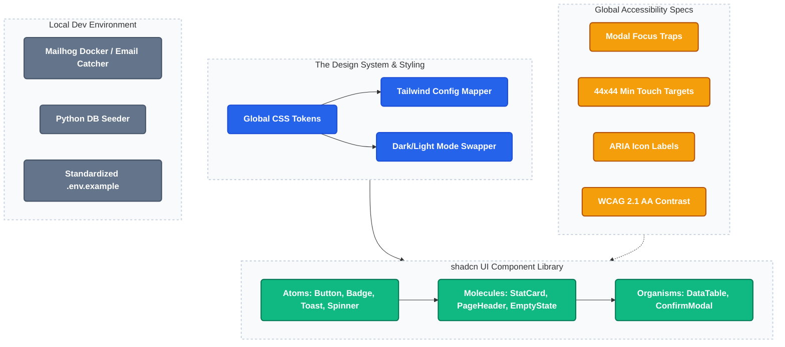

**[BACKEND]**
- Mailhog added to docker-compose for local email testing and debugging.
- Database seed script (`seed_dev_data.py`) for reproducible development states.
- Standardized environment variables fully documented in `.env.example`.

**[FRONTEND]**
- Dark-mode first design tokens in `globals.css` bridged via `tailwind.config.ts`.
- Typography scale and semantic color set defined.
- Reusable UI component library (`Button`, `Badge`, `StatCard`, `DataTable`, `Toast`, `ConfirmModal`, `EmptyState`, etc.).
- Standard page layout pattern: Breadcrumb -> PageHeader -> Stat row -> DataTable -> EmptyState.
- Accessible modal implementations with focus traps, escape-to-close, and visible outlines.
- WCAG 2.1 AA color contrast validation and minimum 44x44px touch-target guidance enforced.

---

## Phase 1 — Foundation, Auth, Tenant Identity & Onboarding
**WHY:** Before any email can be sent, we need a secure multi-tenant foundation. Every query, row, and action must be strictly isolated by `tenant_id`.

### Phase 1 Architecture Flow

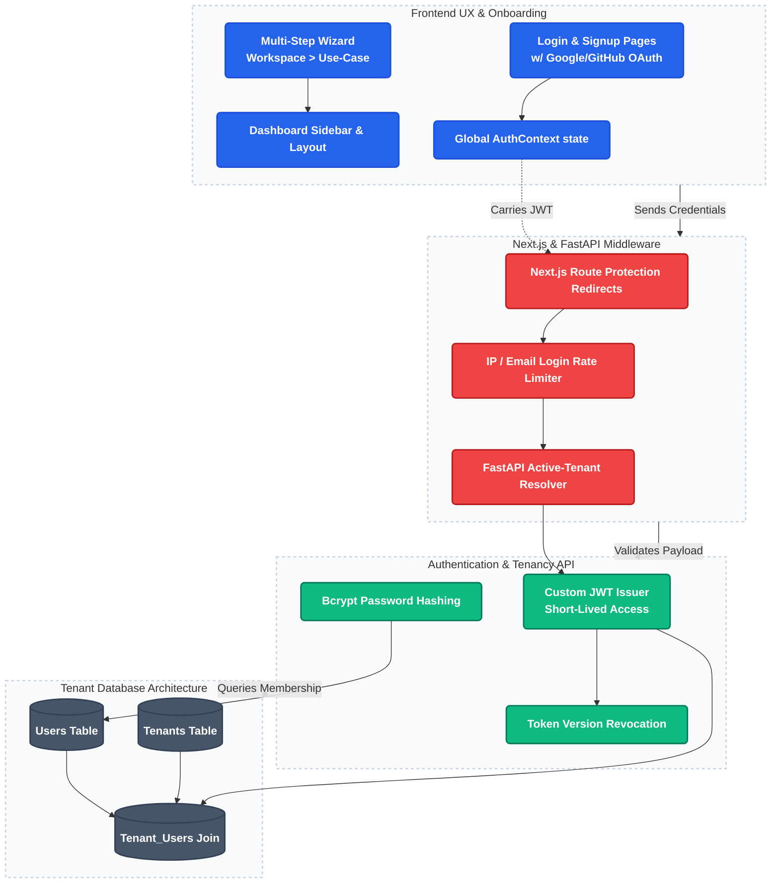

**[BACKEND]**
- Custom email/password auth using bcrypt and JWT validation.
- JWT payloads carry `tenant_id`, `user_id`, `role`, and `email` for rapid authorization.
- Tenant membership model linking `users`, `tenants`, via a `tenant_users` join table.
- Onboarding APIs providing step-by-step wizard endpoints (workspace creation, use-case selection).
- Active-tenant request-time guards verifying valid workspace context.

**[FRONTEND]**
- Modern Login and Signup pages supporting Social Auth (Google/GitHub context).
- Multi-step interactive onboarding wizard (`workspace` -> `use-case` -> `integrations` -> `scale` -> `complete`).
- Sidebar navigation layout governing the dashboard shell.
- Global `AuthContext` distributing verified session state across components.
- Middleware executing route protection and redirecting unauthenticated traffic safely.

---

## Phase 1.5 — Auth Hardening & Audit Logging
**WHY:** Secures the core authentication layer and introduces deep observability for crucial tenant actions.

**[BACKEND]**
- Immutable audit log table recording metadata securely (`user_id`, `tenant_id`, `action`, `resource_type`, timestamp). Never logs sensitive email contents or PII lists.
- Log severity levels distinguishing INFO, WARNING, and CRITICAL actions.
- Automated system alerts via Centralized System Emailer triggering when CRITICAL events occur (e.g., massive contact deletion).
- Two-factor auth (TOTP) generation capability for workspace administrators.

**[FRONTEND]**
- Audit log viewer UI component allowing workspace owners to filter team actions chronologically.
- 2FA setup screen rendering secure QR codes and validating TOTP generation.

---

## Phase 1.6 — GDPR & Legal Compliance
**WHY:** Ensures the system complies with EU data regulations securely before enterprise deployment.

**[BACKEND]**
- Async data export API generating ZIP files of all tenant contact data using a job queuing system avoiding HTTP timeouts.
- "Right to be Forgotten" endpoint triggering PII anonymization (`deleted@gdpr.invalid`) instead of hard deletion to perfectly preserve aggregate analytics history.
- Soft-delete architectural pattern utilizing `deleted_at` timestamps establishing a 30-day "recycle bin" restoration window.
- Consent tracking capturing import source, exact timestamp, and originating IP upon list ingestion.

**[FRONTEND]**
- Quick data export request functionality in Settings routing download instructions to email.
- Restoration action flows permitting users to undelete soft-deleted items.
- Specific consent and source columns visibly rendered in the contacts data table.

---

## Phase 2 — Contacts Engine
**WHY:** Contacts are the core dataset. This phase creates a stable, scalable lifecycle for importing, managing, suppressing, and tagging audiences.

### Phase 2 Architecture Flow

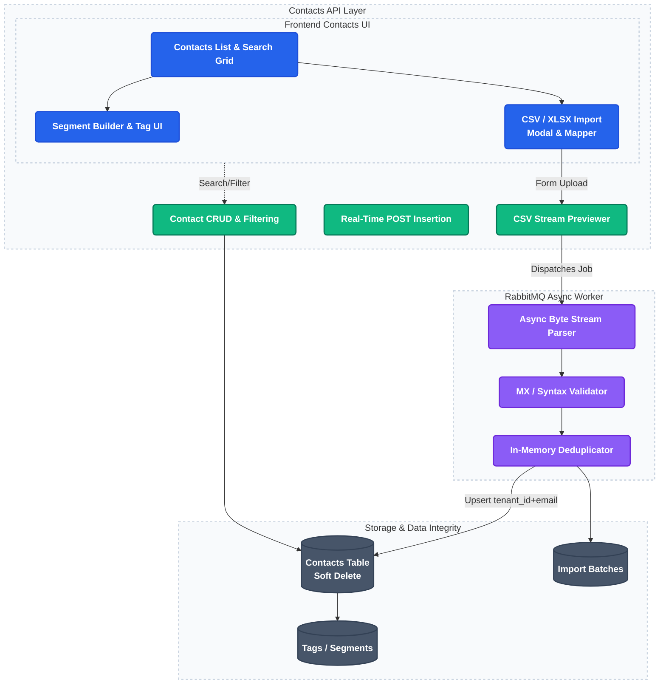

**[BACKEND]**
- High-performance, streaming CSV/XLSX ingestion running asynchronously via RabbitMQ to support gigabyte-scale datasets.
- Real-time single contact insertion REST API designed for external CRM or web-form integrations.
- Tiered validation sequence rejecting malformed domains and detecting Disposable Email Providers instantly.
- Complex deduplication and append behavior preventing collisions.
- Contact scoring system assigning Engagement Scores (e.g., "Inactive", "Highly Engaged").
- **Smart Data Mapping & Splitting**: Enforce strict JSON key normalization during CSV imports (e.g., mapping "Full Name" to `first_name` and `last_name` via automatic string splitting) to guarantee Merge Tags resolve correctly.

**[FRONTEND]**
- robust Contacts grid implementing native search, sorting, and pagination logic.
- Import modal UI presenting column mapping and visualizing background polling progress.
- Specific status badges illustrating Subscribed, Bounced, or Unsubscribed states.
- Dedicated Suppression List view exposing spam complaints and hard bounces.
- Dynamic segment builder targeting specific field permutations.

---

## Phase 3 — Template Engine & AI Content Creation
**WHY:** Email content must be responsive, dynamic, and perfectly rendered across extreme client environments (Outlook, Gmail, Apple).

### Phase 3 Architecture Flow

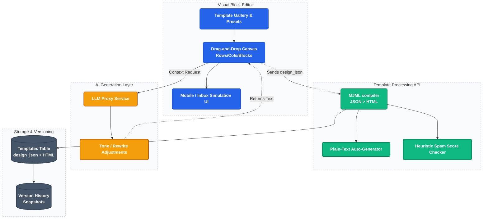

**[BACKEND]**
- Layout preservation logic persistently tracking complex Template JSON constructs.
- MJML processing pipeline compiling abstract blocks into highly compliant render-safe HTML.
- Template versioning creating immutable snapshots for draft restorations.
- Plain-text auto-generation matching HTML changes automatically.
- Email spam heuristic checker rating subject/body language.
- **AI-Assisted Content Generation API**: Backend proxy to LLM endpoints designed to rewrite, adjust tone, or generate email copy dynamically based on tenant prompts.

**[FRONTEND]**
- Visually rich template gallery with selectable preset starting points.
- Interactive structured block editor (Rows -> Columns -> Content Blocks).
- Responsive view toggles forcing desktop vs mobile rendering simulation inside the canvas.
- Inbox preview mode mocking specific visual anomalies of major clients.
- Send test email functionality seamlessly embedding custom merge-tag dummy data.
- **AI Copywriting Assistant UI**: Magic-wand contextual buttons generating subject lines or rewriting paragraphs inline inside the editor canvas.

---

## Phase 4 — Campaign Orchestration
**WHY:** Orchestrates the core action of filtering audiences, attaching content, validating legality, and queuing dispatches.

### Phase 4 Architecture Flow

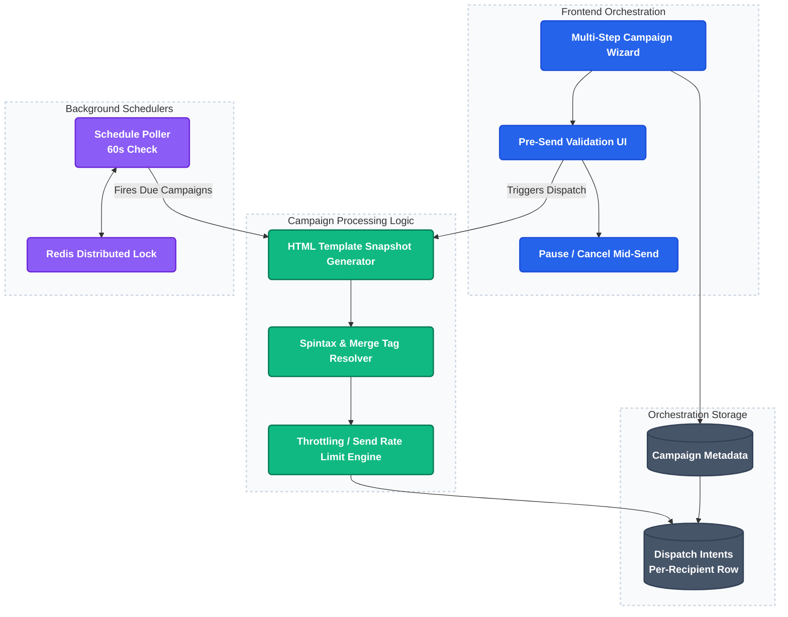

**[BACKEND]**
- Snapshotting logic immutably locking campaign HTML and metadata exactly at send time.
- Spintax capability injecting alternating subject variations and localized merge-tag parsing.
- **Merge Tag Fallback Engine**: Systematically injects default fallback strings (e.g., "Customer") when a personalization token like `{{first_name}}` attempts to map to an empty database field, preventing broken or awkward emails.
- Scheduling engine committing tasks to execution timestamps.
- Dispatch throttling gate controlling total per-minute injection rates preventing SMTP connection flooding.

**[FRONTEND]**
- Multi-step Campaign Creation Wizard sequentially ordering details, audience targeting, content review, and summary checks.
- Pre-send checklist enforcing presence of Unsubscribe links, physical addresses, and blank subjects before enabling the Send action.
- Schedule picker allowing exact timezone-aware delivery planning.
- "Send to 5% sample" interactive switch for risk-free trial runs.
- Instant Pause and Cancel actions surfaced on active dashboard panels.

---

## Phase 5 — Delivery Engine
**WHY:** Connects the system to the internet via SMTP, automatically responding to bounces, spam complaints, and user unsubscriptions securely.

### Phase 5 Architecture Flow

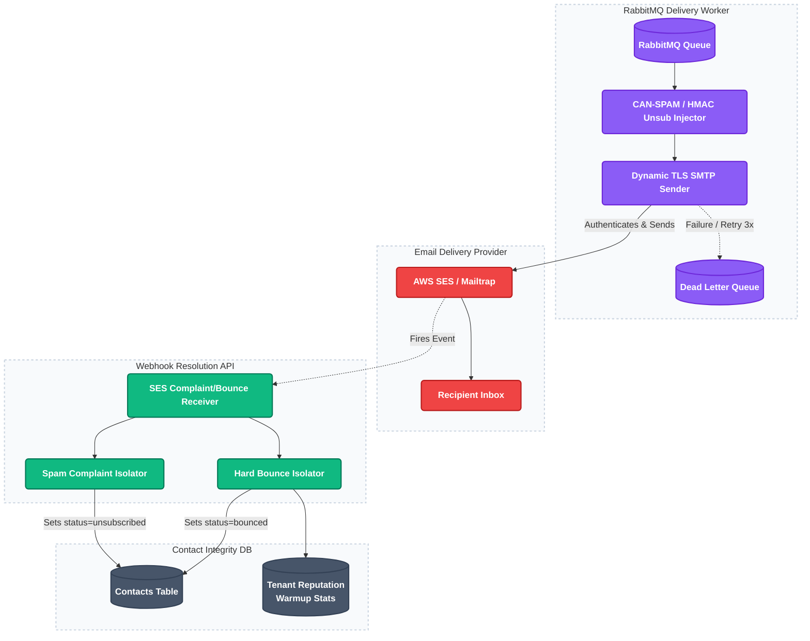

**[BACKEND]**
- RabbitMQ consumer loop maintaining persistent connections, dynamically executing TLS handshakes, and nacking failures into Dead Letter Queues gracefully.
- Legal footer injection statically appending CAN-SPAM compliant company addresses and HMAC-secure unsubscribe tokens.
- Immediate bounce classification logic segregating Soft Bounces (retried exponentially) from Hard Bounces (instantly placed on permanent suppression list).
- Spam complaint webhook ingestion directly suppressing contacts from further dispatches preventing reputation destruction.
- Domain warmup throttler incrementally raising outbound execution limits across 30 days.
- Tenant reputation tracking evaluating 30-day rolling bounce/spam statistics against critical suspension thresholds.

**[FRONTEND]**
- Clean Unsubscribe landing page capturing voluntary removal events effortlessly.
- Re-subscribe form confirming reversal of accidental unsubscribes.

---

## Phase 6 — Observability & Analytics (Heatmaps & Time Tracking)
**WHY:** Displays critical performance markers allowing users to judge campaign effectiveness accurately.

### Phase 6 Architecture Flow

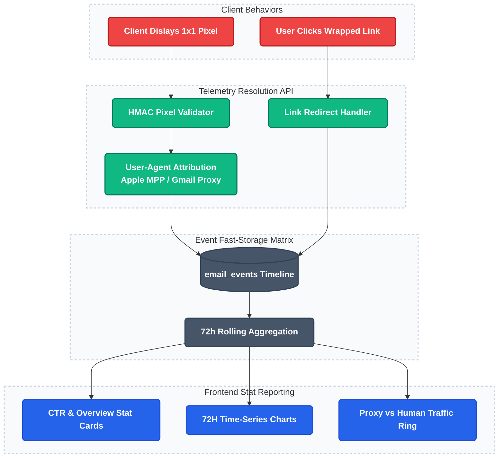

**[BACKEND]**
- 1x1 image pixel endpoint logging secure opens, guarded by heuristic Bot Detection rules distinguishing Google/Apple privacy proxies from malicious scanners or true humans.
- Click tracking honeypots dropping bots mimicking link engagement.
- Stats aggregation routines executing asynchronously to compile real-time summaries.
- **Time Spent Tracking Calculation**: Multi-ping pixel tracking logic classifying the duration a recipient hovered over the message.
- **Click Heatmap Calculation Job**: Aggregation engine correlating click event URLs directly back to their DOM position in the exact sent template.

**[FRONTEND]**
- Detailed Campaign Analytics Dashboard exhibiting exact unique open, click, and bounce matrices.
- Recipient timeline exposing chronological interactions per individual contact.
- Time Series graph plotting engagement velocity across the immediate 72 hours post-send.
- **Click Heatmap Overlay Presentation**: Visually injecting heat maps directly onto the template preview canvas illustrating intense link engagement locations.
- **Engagement Duration Card**: UI stat displaying average read times effectively.

---

## Phase 7 — Plan Enforcement & Billing
**WHY:** Regulates computational exhaustion, prevents abuse, and ties usage directly to recurring revenue tiers.

### Phase 7 Architecture Flow

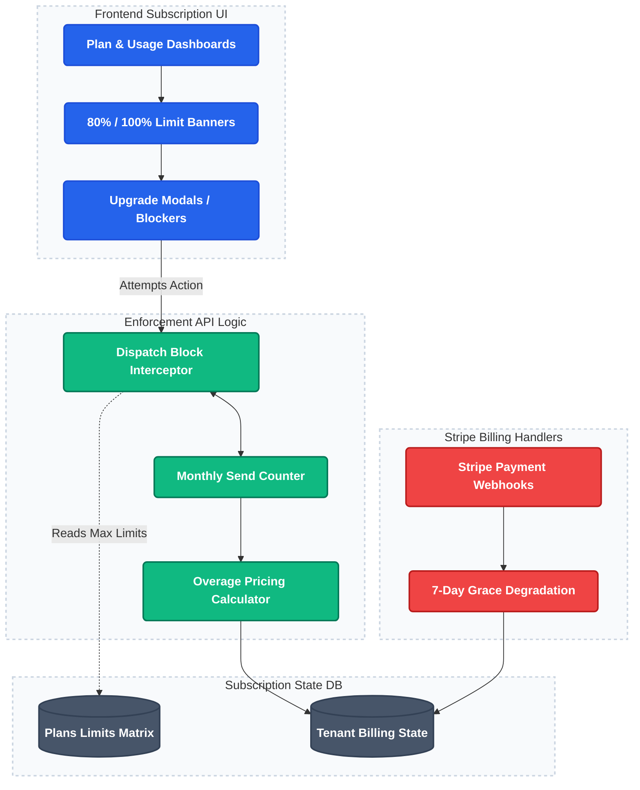

**[BACKEND]**
- Quota limiting services tracking precise daily and monthly volumetric outputs per tenant against defined tier maximums.
- Overage pricing intercept logic preventing hard-blocks while securely calculating micro-payments for excess bursts.
- Billing state watcher gracefully degrading system access rather than violently deleting instances upon payment failure.
- Auto-pause directives halting massive campaigns if quotas breach mid-flight.

**[FRONTEND]**
- Beautiful Plan & Usage page projecting consumption visuals natively via animated progress bars.
- Strategic warning banners displaying precisely at 80% usage and 100% capacity triggers.
- Blocking overlays actively freezing specific forms when quotas permanently prevent initiation.

---

## Phase 7.5 — Infrastructure & DevOps
**WHY:** Solidifies architectural foundations ensuring deployment stability, fault tolerance, and developer sanity.

### Phase 7.5 Architecture Flow

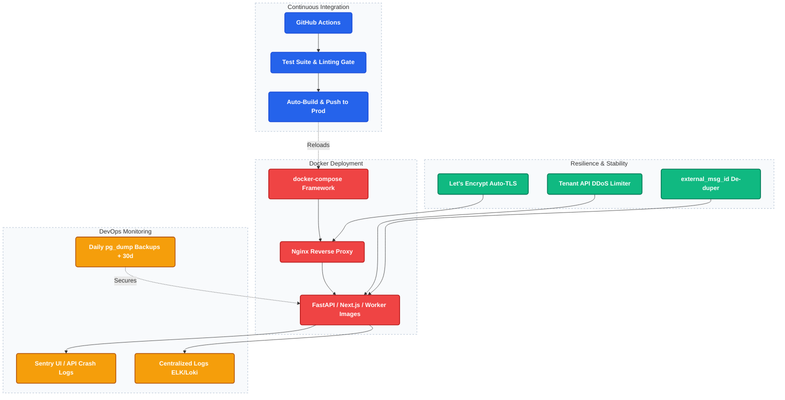

**[BACKEND]**
- Docker orchestration wrapping APIs, Frontend frameworks, Queues, and Caches synchronously.
- Nginx configuration restricting ports and terminating SSL properly.
- Strict API Rate limiter specifically keying on `tenant_id` to prevent single-tenant database DOS attacks.
- Background Job Status synchronization allowing decoupled UI systems to query asynchronous progression globally.
- Error interception hooks funneling unhandled exceptions directly into centralized monitoring stations (Sentry).

**[FRONTEND]**
- Stringent Content-Security-Policy responses blocking inline execution preventing cross-site scripting natively.
- UI Toasts dynamically connected to generic job endpoints simulating real-time progress for heavy tasks.

---

## Phase 8 — Account Settings & Administration
**WHY:** Enables self-serve technical configuration for tenants removing the need for manual support intervention.

### Phase 8 Architecture Flow

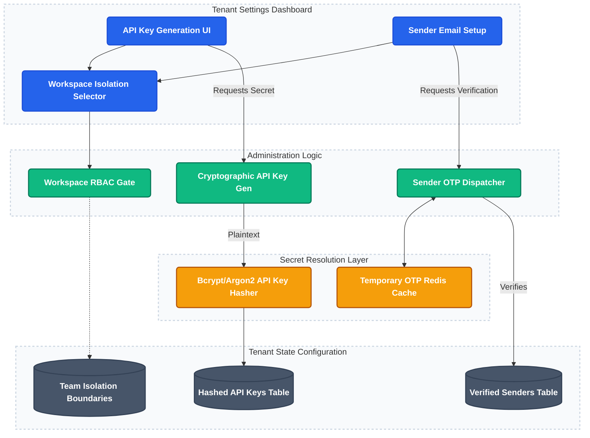

**[BACKEND]**
- Secure sender verification logic dispatching short-lived OTP tokens confirming access over custom sender addresses.
- API Key management infrastructure storing hashes rather than plain text.
- Team workspace isolation logic respecting `team` vs `agency` data boundary matrices.
- Fine-grained role evaluation checks separating Viewer, Operator, Manager, and Admin actions cleanly.

**[FRONTEND]**
- Organizational configuration sub-panels modifying required CAN-SPAM geographical details natively.
- Sender Identity Verification wizard visually explaining complex SPF/DKIM/DMARC DNS insertions succinctly.
- Member invitation flow rendering distinct role assignment dropdowns intuitively.
- Comprehensive API Dashboard detailing exact daily consumption and tracking rejection trends visually.

---

## Phase 9 — Security, Compliance & Deliverability Infrastructure
**WHY:** Ensures emails reach the inbox natively without landing in spam, maintaining strict data compliance and backup integrity.

### Phase 9 Architecture Flow

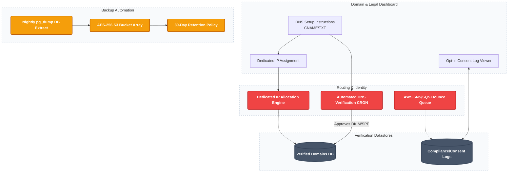

**[BACKEND]**
- Dedicated IP Allocation engine attaching isolated IPs per high-tier tenant.
- Automated DNS Verification CRON constantly scanning CNAME/TXT records for DMARC/SPF/DKIM validity.
- Bounce & Spam complaint SNS/SQS queue ingestion.
- Nightly `pg_dump` backups natively pushing AES-256 encrypted payloads to S3 with 30-day retention policies.

**[FRONTEND]**
- DNS Setup Instructions rendering exact copy-paste values for external providers natively.
- Dedicated IP health monitoring widget.
- GDPR Compliance / Opt-in consent log viewer.

---

## Phase 10 — Advanced Campaigns & Knowledge RAG Bot
**WHY:** Deep automation workflows and intelligence mechanisms dramatically optimizing open rates naturally.

### Phase 10 & 10.5 Architecture Flow (Advanced Campaigns & Deep RAG)

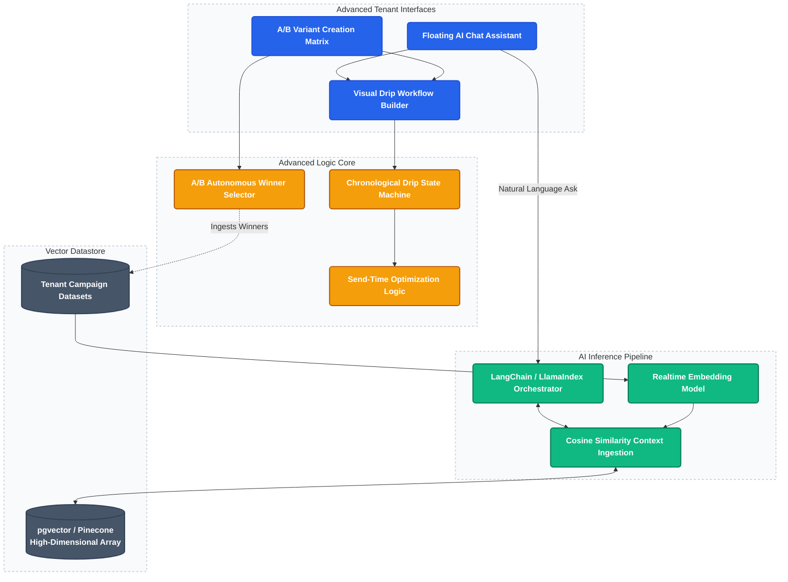

**[BACKEND]**
- Audience A/B split logic partitioning recipients evenly and identifying open-rate winners autonomously.
- Drip campaign orchestration routing logic based on predefined chronological state machines.
- Send-time optimization evaluating historical recipient logs and distributing emails perfectly to the exact peak individual window.
- **Knowledge RAG Bot Service**: Advanced Vector-Database connection (Retrieval-Augmented Generation) continuously indexing the tenant's exact successful templates, tone definitions, and audience responses mathematically.

**[FRONTEND]**
- Multi-variant A/B creation UI integrating directly inside the campaign builder cleanly.
- Visual canvas implementing drag-and-drop conditions creating Drip automated sequence flows.
- **Strategy Chatbot RAG Widget**: Sliding sidebar chatbot specifically contextualized on the tenant's data enabling advanced interrogations ("Write me a follow-up heavily replicating the absolute best subject line we utilized in Q2").
---

## Phase 10.5 — AI & Deep RAG Integration
**WHY:** Transforms the platform from a manual sending tool into an intelligent marketing assistant leveraging the tenant's own historical data.

**[BACKEND]**
- **Vector Database Provisioning**: Setup pgvector (or Pinecone) to store high-dimensional embeddings.
- **Data Ingestion Pipeline**: Asynchronously chunk and embed successful campaign HTML, subject lines, and send-time metrics every time a campaign completes.
- **Semantic Search API**: Endpoint taking natural language queries, embedding them, and performing cosine-similarity searches against the tenant's vector namespace.
- **LLM Orchestration Layer**: LangChain/LlamaIndex implementation processing retrieved context and generating grounded responses without hallucinations.

**[FRONTEND]**
- **Global AI Assistant Widget**: Floating chat module available across all pages maintaining conversation history.
- **Prompt Library UI**: Curated list of starter questions ("Analyze my last 3 campaigns", "Generate a segment for unengaged users").
- **Segment / Filter Generator**: Natural language input box on the Contacts page that auto-configures complex dropdown filters based on AI interpretation.
- **Deliverability Explainer Modal**: "Explain this" button next to raw SMTP bounce codes that opens an AI-generated, plain-English summary of the exact fix needed.

---

## Phase 11 — API & Integrations
**WHY:** Creates extreme extensibility via headless consumption and outgoing system webhooks.

### Phase 11 Architecture Flow

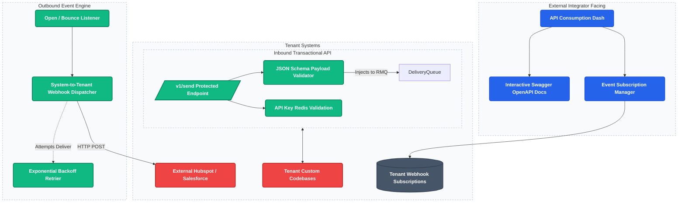

**[BACKEND]**
- Dedicated `/v1/send` REST API architecturally prioritizing transactional payload executions reliably.
- Webhook notification engine repeatedly attempting (via exponential backoff) to alert external tenant interfaces upon open/click/bounce milestones.

**[FRONTEND]**
- Developer portal natively hosting interactive OpenAPI documentation components cleanly.
- Webhook management interface facilitating specific event subscriptions visually.

---

## Phase 12 — Enterprise Domain Auto-Discovery (JIT Provisioning)
**WHY:** Reduces extreme onboarding friction for massive organizations via automatic corporate-domain correlation.

**[BACKEND]**
- JIT provisioning processor intercepting recognized corporate domains reliably.
- PDEP Filter aggressively blocking free providers (Gmail, Yahoo) from discovery mechanisms.
- VBD (Verification-Before-Disclosure) forcing OTP entry identically before confirming domain existence preventing reconnaissance.
- Active Directory SSO integrations via secure SAML/LDAP bridges mapping user roles reliably.

**[FRONTEND]**
- Custom waiting room interfaces reassuring unapproved employees cleanly.
- Governance Portal rendering direct approval matrices prioritizing swift IT Administrator workflow ingestion natively.

---

## Phase 13 — Scale & Microservices
**WHY:** Separating bounded contexts logically when extreme transaction volumes demand independent scaling axes natively.

**[BACKEND]**
- Complete decomposition partitioning Auth, Contacts, Delivery, Templates, and Analytics functionally across separated containers.
- Message bus replacements upgrading database-polling directly into Redis-backed asynchronous workers natively.
- Blacklist verification CRON continuously pinging MXToolbox API monitoring IP health perpetually.

**[FRONTEND]**
- Degraded-state conditional rendering preserving essential UI functionality even when sub-scale internal matrices disconnect slightly (e.g. allowing editing while analytics systems update).

---

## Notification Strategy

**In-App (Toast/Banner UI)**
- Campaign dispatched, Campaign paused, SMTP error warnings, Quota limit alerts, Daily list validations.

**System Emails (Sent via Centralized System Emailer)**
- Sender Identity OTPs, Campaign completion analytical summaries, Password resets, Payment failed alerts, Monthly usage recitals.

**System/Legal Emails (Appended internally to every dispatched campaign)**
- Clean un-subscription notifications natively respecting external click intercepts securely.
- Mandatory CAN-SPAM/GDPR entity address placements enforcing platform legality completely.

---

## Database Index Strategy (Critical for Scale)
- `contacts(tenant_id, email)` — Fast deduplication.
- `email_tasks(status, scheduled_at)` — Ultra-fast worker polling.
- `campaigns(tenant_id, status)` — Fast dashboard loading.
- `audit_logs(tenant_id, timestamp)` — Fast compliance fetching.
- `email_events(campaign_id, contact_id)` — Fast analytical aggregations.
- `sender_identities(verification_token)` — Secure fast-lookups during identity validation.
