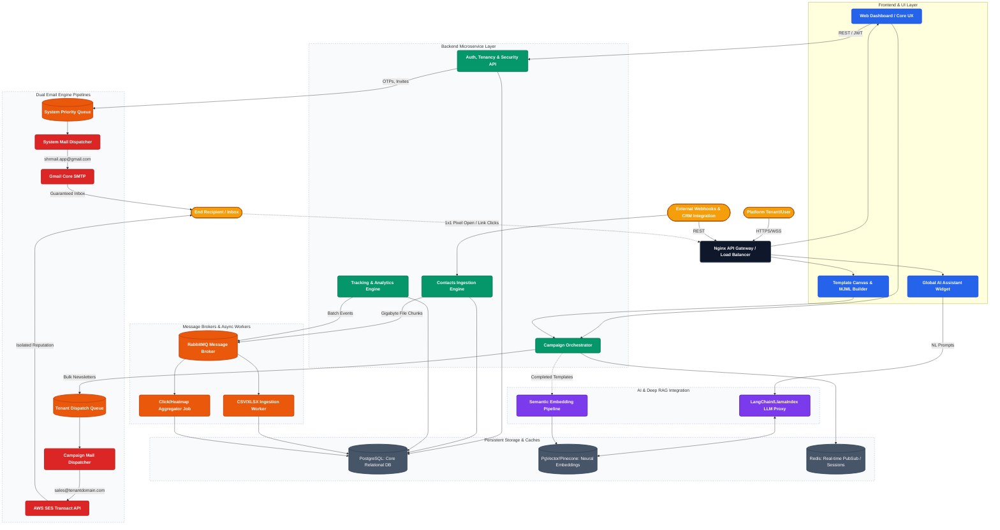

# ShrFlow (Email Engine) — Complete Architectural Overview

This document serves as the high-level, definitive blueprint of the entire ShrFlow infrastructure. It synthesizes all technical decisions spanning Frontend UX, Backend microservices, Asynchronous Message Queues, Data Stores, API gateways, Artificial Intelligence (RAG), and dual SMTP Delivery pipelines into a single cohesive ecosystem.

---

## 🏗 The Complete Platform Architecture

The architecture below illustrates how data flows from the Tenant (User Interface) down through the various application tiers, all the way to explicit email dispatch and open/click analytical feedback loops.

*(You can view this diagram natively in any Markdown previewer that supports Mermaid.js)*

---

## Technical Summaries of Key Layers

### 1. The Gateway & Frontend
*   **The Hub:** All external user traffic, integrations, and webhook injections hit the heavily protected **Nginx API Gateway**, which enforces strict Rate Limiting (`tenant_id` based blocks prevent single-app flooding) and terminates SSL layers.
*   **User interfaces:** Contains robust React components including the Drag-and-Drop MJML Editor and multi-step Wizards.

### 2. Backend Microservice Layer
*   To enable "Phase 13 – Massive Scale," responsibilities are split:
    *   **Auth & Tenancy:** Validates JWTs, handles SAML/Active Directory (JIT) provisioning, establishes domain ownership, and tracks Role checks.
    *   **Contacts Engine:** High-performance REST ingest points. Validates malformed emails instantly.
    *   **Analytics Engine:** High-velocity endpoint designed specifically to rapidly ingest `1x1 image pixel` Open requests and catch Click engagements without ever lagging. 

### 3. Asynchronous Orchestration (RabbitMQ & Redis)
*   **RabbitMQ:** Crucial for the platform not timing out. Instead of failing when 50,000 users are imported, the file is dumped onto RabbitMQ, and the **CSV Ingestion Worker** streams it into Postgres quietly in the background.
*   **Failed Deliveries:** Handles soft-bounces with automated exponential retries. Redlines hard-bounces immediately to the "Dead Letter Queue".

### 4. Persistent Storage (PostgreSQL & PgVector)
*   **Postgres:** Primary source of truth. Highly indexed utilizing structures like `email_tasks(status, scheduled_at)` for millisecond query times.
*   **PgVector / Pinecone:** Powers Phase 10.5. Once an email is sent successfully, its contents are chunked, embedded via AI neural networks, and saved sequentially.

### 5. Artificial Intelligence (RAG Integration)
*   The **AI Orchestrator** reads user prompts ("Analyze our best subjects this month"), queries the **PgVector database** to retrieve historical tenant data, embeds that data alongside the prompt (RAG pattern), and returns absolutely hallucination-free, factual platform advice.

### 6. The Dual Delivery Engine (The Heart)
*   The ultimate protection layer guaranteeing survival. 
*   **System Mails** (password resets, quota warnings) bypass all complexity and queue straight into Gmail environments ensuring inbox placement regardless of external server blacklisting events.
*   **Campaign Mails** (large scale promotional sending) flow to the tenant's exact Verified Domain over AWS SES to completely quarantine sender reputation and ensure absolute volume scalability. 
*   **Analytics Loopback:** Every click an End Subscriber takes dynamically routes back directly into the API Analytics Engine, feeding the Heatmap worker loop. 

---
